# 串联腿机器人建模与控制开源文档

浙江大学HelloWorld 战队烟霞志

2026年8月28日

# 目录

| 1 前言 |             | 5  |
|------|-------------|----|
| 第一部分 | 模型与控制器生成    | 5  |
| 2    | 建模说明与假设     | 5  |
| 2.1  | 坐标系         | 6  |
| 2.2  | 平面运动与航向自由度  | 6  |
| 2.3  | 纯滚动假设       | 6  |
| 2.4  | 双腿独立变长      | 6  |
| 2.5  | 刚体与机构折叠假设   | 7  |
| 2.6  | 腿长作为参数      | 7  |
| 2.7  | 平衡点线性化假设    | 7  |
| 3    | 广义坐标与状态空间构造 | 7  |
| 3.1  | 状态与输入       | 7  |
| 3.2  | 几何参数        | 8  |
| 3.3  | 机体参数        | 8  |
| 3.4  | 轮参数         | 9  |
| 3.5  | 腿参数         | 9  |
| 3.6  | 其余几何量       | 9  |
| 3.7  | 中间变量        | 9  |
| 3.8  | 坐标、符号与几何约束  | 10 |
| 3.9  | 广义坐标到系统位姿映射 | 10 |
| 3.10 | 线性化所需加速度映射  | 11 |

| 4 牛顿 | 欧拉动力学列式                  | 11 |
|------|--------------------------|----|
| 4.1  | 受力与力矩定义                  | 11 |
| 4.2  | 轮子子系统                    | 11 |
| 4.3  | 腿部子系统                    | 12 |
| 4.4  | 机体子系统与航向方程               | 12 |
| 4.5  | 约束、消元与最小状态方程             | 12 |
| 5    | 平衡点线性化                   | 13 |
| 5.1  | A orig 的显式结构（对应符号推导结果）   | 13 |
| 5.2  | B u 与 B x 的显式矩阵          | 14 |
| 5.3  | B of fset 的显式向量（重力静态偏置项） | 15 |
| 6    | 静态平衡前馈求解                 | 15 |
| 7    | 腿长扫描与多项式拟合流程             | 16 |
| 7.1  | 一维几何 / 惯量拟合              | 16 |
| 7.2  | 二维腿长网格扫描与拟合              | 16 |
| 8    | 摆腿前馈                     | 16 |
| 8.1  | 准静力平衡与所需摆角               | 17 |
| 8.2  | 线性化前馈与固件简化式              | 17 |
| 8.3  | 几何行程、闸门与时间尺度             | 18 |
| 8.4  | 闭环约束下的参数选取               | 18 |
| 9    | 说明与适用范围                  | 19 |
| 第二部分 | 在机控制实现                   | 19 |
| 10   | 状态估计与观测量构造               | 19 |
| 10.1 | 虚拟腿状态解算                  | 19 |
| 10.2 | 轮心速度与底盘速度                | 23 |
| 10.3 | IMU 姿态解算与杆臂补偿            | 23 |
| 10.4 | 机体加速度投影                  | 23 |
| 10.5 | 底盘速度卡尔曼滤波                | 24 |
| 10.6 | 支持力估计                    | 25 |
| 11   | 检测层                      | 26 |
| 11.1 | 触地与离地检测                  | 26 |
| 11.2 | 异常检测与分级                  | 27 |
| 11.3 | 台阶检测                     | 28 |

| 11.4  | 障碍测距与跳跃触发窗口              | 28           |
|-------|--------------------------|--------------|
| 11.5  | 超时保护                     | 29           |
| 12    | 功率模型与功率控制实现              | 29           |
| 12.1  | 稳态功率模型                   | 29           |
| 12.2  | 可用功率的计算                  | 30           |
| 12.3  | 降额系数的求解与施加               | 31           |
| 12.4  | 功率控制的使能条件                | 31           |
| 12.5  | 功率限制物理模型                 | 31           |
| 12.6  | 优化点                      | 31           |
| 13    | 控制系统状态机执行架构              | 32           |
| 13.1  | 每周期的执行顺序                 | 32           |
| 13.2  | 第一层：电源状态                 | 33           |
| 13.3  | 第二层：事件生成                 | 33           |
| 13.4  | 第二层：优先级仲裁                | 34           |
| 13.5  | 第二层：状态转移的合法性规则           | 34           |
| 13.6  | 第三层： Recovery （倒地恢复）子状态机 | 35           |
| 13.7  | 第三层： Mature （稳态平衡）子状态机   | 38           |
| 13.8  | 第三层： Jump （主动跳跃）子状态机     | 39           |
| 13.9  | 第三层： Flight （被动腾空）子状态机   | 41           |
| 13.10 | 第三层： Onestep / Twostep   | （上台阶）子状态机 42 |
| 13.11 | 并行维度：工作模式                | 43           |
| 13.12 | 指令整形层                    | 44           |
| 13.13 | 防翻保护                     | 44           |
| 13.14 | 输出链                      | 45           |
| 13.15 | LQR 增益掩码调度               | 48           |
| 14    | 过坎                       | 48           |
| 14.1  | 有趣设计                     | 48           |
| 14.2  | 检测判据                     | 49           |
| 14.3  | 触发条件与使能门控                | 49           |
| 14.4  | 触发后的动作                   | 49           |
| 14.5  | 退出条件                     | 51           |
| 14.6  | 成功率                      | 51           |
| 15    | 纵向控制体系                   | 51           |
| 15.1  | 纵向速度轨迹规划器                | 52           |
| 15.2  | 摆腿前馈的在线生成                | 52           |

| 目录   |               | 4  |
|------|---------------|----|
| 15.3 | 静态配平与摆角参考合成   | 53 |
| 15.4 | 大摆角参考降权       | 54 |
| 15.5 | 加速度与速度上限的高度调度 | 54 |
| 15.6 | 跟随模式下的航向收敛    | 54 |
| 附件   | 轮腿机器人底盘功率模型   | 55 |

# 1 前言

HelloWorld 战队的串联腿机器人是在25赛季正式立项的,但是因为传承断代、人 手不足、实力有限等原因,25赛季并没有造出一台能够达到上场要求的串联腿机器人。 26赛季初,队伍决定在原有的基础上继续推进串联腿机器人的研发工作,后续在寒假造 出了串联腿哨兵,又在分区赛前一周左右造出了串联腿步兵。不合理的进度推进与超乎 寻常的多重压力使得原先的串腿步兵电控在分区赛前夕离开了队伍,作者(原腿哨电 控)因而兼任串腿步兵电控。在此感谢前串腿步兵电控为控制系统做出的卓越贡献。

分区赛后,因严重的队伍内部问题以及考试周临近,调试与研发基本停摆,作者转 向与硬件一起研究缓冲电容的控制以解决分区赛不能实现大跳的问题,在暑假开始后 的3-5天内一同完成了缓冲电容的控制系统设计与调试。串联腿控制系统的设计在暑假 前往临港调试后基本完成,基本实现了对本赛季场地的适应。

本文档是对国赛上场的串联腿哨兵/步兵控制系统设计的完整说明(其实是对临港 期间的完整说明,回杭后缺少场地,搭的简陋场地还原性太差,导致国赛期间的发挥还 没有在临港发挥的好,加的一些 trick 也不太好用),内容分为两大部分。

前半部分(第 2 至 9 节)为模型与控制器生成:包括建模假设、广义坐标与状态 空间构造、牛顿-欧拉动力学列式、平衡点线性化、静态平衡前馈求解、腿长扫描与多 项式拟合流程,以及摆腿前馈参数的离线仿真优化等。

后半部分(第 10 至 15 节)为在机控制实现:包括状态估计与观测量构造、接触 与异常检测体系、分层状态机的组成及每个状态的触发条件、动作与退出条件、指令整 形与输出映射链、基于稳态功率模型的能量约束实现,以及步兵版本的纵向控制体系。

作者的能力有限,下述内容难免有疏漏、错误与不合理之处,欢迎各位读者批评指 正。

# 第一部分 模型与控制器生成

# 2 建模说明与假设

本模型是在【RM2023-平衡步兵控制系统开源】上海交通大学-云汉交龙的WBR模 型基础上进行改进的,非常感谢交龙的开源工作。

本模型的全部动力学推导建立在以下假设之上。超出假设范围的工况不在模型内 描述,由检测层与状态机另行处理(见后半部分)。

## 2.1 坐标系

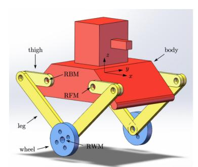

图 1: 坐标系

固连在质心上的质心坐标系的 x轴指向身体前方, z轴指向上方, y轴与 x轴、 z轴 构成右手系。

### 2.2 平面运动与航向自由度

模型只描述平面内的前后运动与俯仰耦合,并保留由左右轮差动引入的航向角 ϕ 这一自由度;滚转自由度不进入动力学模型,其由独立的腿长差控制环维持,因滚转自 由度带来的侧翻风险由速度—角速度乘积限制与防翻闭环显式约束(见第 [13.13](#page-43-1) 节与第 [15](#page-50-2) 节)。

# 2.3 纯滚动假设

轮与地面之间无滑移,轮心水平位移由轮角严格确定

$$s = \frac{R_w}{2}(\theta_{w,l} + \theta_{w,r}), \quad (1)$$

轮地摩擦力作为内力在方程消元中显式求解。打滑、空转等不满足纯滚动假设的工况, 由卡尔曼滤波进行速度修正、腾空观测切换等机制在检测层补偿。

#### 2.4 双腿独立变长

左右腿的长度、质量与惯量参数允许互不相同,不对双腿做对称假设。双腿独立变 长其实使竖向支撑力成为需要联立求解的未知量,必须引入竖向支持力约束

$$F_{wh,l} = F_{wh,r} \quad (2)$$

闭合方程组,换来的是对单侧下台阶、侧向斜坡这类非对称工况的描述。当然支持力约 束并不足够合理,实际测试中计算得到的两腿支持力总有一定的偏差,建议感兴趣者在 后续自行建模中引入滚转自由度,建立一个更完整的动力学模型(如果希望控的更好, 我的建议是一步到位去试试强化学习)。

# 2.5 刚体与机构折叠假设

机体、两条腿与轮均视为刚体,质量与惯量以集中参数描述。腿的伸缩由相似五连 杆机构实现,机构内部自由度被正运动学折叠为虚拟腿长度 li 与虚拟腿角度两个广义 量;机构辅助弹簧视为执行器层的附加扰动,在机侧由弹簧补偿抵消,不进入 LQR 动 力学模型。

# 2.6 腿长作为参数

腿长由独立的腿长控制环闭环维持,在动力学模型中不作为状态量而作为调度参 数处理,通过二维腿长网格扫描与多项式曲面拟合,控制器在每个控制周期跟随腿长变 化更新增益。

# 2.7 平衡点线性化假设

动力学在零角度、零角速度、零输入、零加速度的平衡点附近做一阶泰勒展开,得 到线性定常模型,因此模型只在平衡点附近的小角度工况内严格成立。大姿态偏离时模 型不再精确,但求得的增益仍可用;过于偏离时由状态机切换至异常状态与特种流程处 理(见第 [13.7](#page-37-0) 节)。

# 3 广义坐标与状态空间构造

本节定义广义坐标、状态向量与控制输入,给出动力学模型所需的全部参数,并由 广义坐标导出系统位姿与加速度的映射关系,完成状态空间的构造。

## 3.1 状态与输入

十维状态向量定义为

$$\mathbf{X} = [s, \dot{s}, \phi, \dot{\phi}, \theta_{l,l}, \dot{\theta}_{l,l}, \theta_{l,r}, \dot{\theta}_{l,r}, \theta_b, \dot{\theta}_b]^T. \quad (3)$$

控制输入(四通道力矩)定义为

$$\mathbf{U} = [T_{wl,l}, T_{wl,r}, T_{bl,l}, T_{bl,r}]^T. \quad (4)$$

状态向量各分量的物理含义的对应关系如下:

- s:底盘位移
- s˙:底盘速度
- ϕ:航向角

- ϕ˙:航向角速度
- θl,l、θl,r:左/右虚拟腿摆角
- ˙θl,l、 ˙θl,r:左/右虚拟腿摆角速度
- θb:机体俯仰角
- ˙θb:俯仰角速度

四通道控制输入的含义为:

- Twl,l、Twl,r:左/右轮力矩
- Tbl,l、Tbl,r:左/右虚拟腿摆矩

# 3.2 几何参数

- ll:左腿腿长
- lr:右腿腿长
- lw,l:左轮心到左腿质心距离
- lw,r:右轮心到右腿质心距离
- lb,l:左髋关节到左腿质心距离
- lb,r:右髋关节到右腿质心距离
- Rw:轮半径
- Rl:轮半轮距,即两虚拟腿角度相同时,两轮心的水平距离的一半

# 3.3 机体参数

- mb:机体质量
- Ib:机体转动惯量(绕X轴)
- Izz:机体转动惯量(绕Z轴/航向)
- lc:机体质心偏移距离
- ϕc:机体质心偏移角度

#### 3.4 轮参数

- mw:单轮质量
- Iw:单轮转动惯量

#### 3.5 腿参数

- ml,l:左腿质量
- ml,r:右腿质量
- Il,l:左腿转动惯量
- Il,r:右腿转动惯量

## 3.6 其余几何量

- ϕw,l:左轮心到腿质心连线与腿长夹角
- ϕw,r:右轮心到腿质心连线与腿长夹角
- ϕb,l:左髋关节到腿质心连线与腿长夹角
- ϕb,r:右髋关节到腿质心连线与腿长夹角

# 3.7 中间变量

- θw,l、θw,r:左/右轮角
- fl、fr:左/右轮所受地面摩擦力
- Fws,l、Fws,r:左/右轮对腿水平作用力
- Fwh,l、Fwh,r:左/右轮对腿垂直作用力
- Fbs,l、Fbs,r:左/右腿对机体水平作用力
- Fbh,l、Fbh,r:左/右腿对机体垂直作用力

# 3.8 坐标、符号与几何约束

建模采用平面内前后运动与俯仰耦合,并保留由左右轮差动引入的航向角变量 ϕ。 左右腿长度允许不同,分别记作 ll , lr;轮轴到腿质心、髋关节到腿质心距离分别为 lw,l, lw,r 与 lb,l, lb,r。

由三角形几何关系,先定义质心连线夹角:

$$\phi_{w,l} = \arccos\left(\frac{l_{w,l}^2 + l_l^2 - l_{b,l}^2}{2l_{w,l}l_l}\right), \quad \phi_{w,r} = \arccos\left(\frac{l_{w,r}^2 + l_r^2 - l_{b,r}^2}{2l_{w,r}l_r}\right), \quad (5)$$

$$\phi_{b,l} = \arccos\left(\frac{l_{b,l}^2 + l_l^2 - l_{w,l}^2}{2l_{b,l}l_l}\right), \quad \phi_{b,r} = \arccos\left(\frac{l_{b,r}^2 + l_r^2 - l_{w,r}^2}{2l_{b,r}l_r}\right). \quad (6)$$

这些量在给定腿长后可视为几何常量,用于后续质心位置表达。

# 3.9 广义坐标到系统位姿映射

取轮轴中点水平位移 s、机体俯仰角 θb、左右腿角 θl,l, θl,r 及轮角 θw,l, θw,r 为基础 变量。

#### (1) 轮轴中点平移 纯滚动条件给出

| $s = \frac{R_w}{2}(\theta_{w,l} + \theta_{w,r}), \quad \dot{s} = \frac{R_w}{2}(\dot{\theta}_{w,l} + \dot{\theta}_{w,r}), \quad \ddot{s} = \frac{R_w}{2}(\ddot{\theta}_{w,l} + \ddot{\theta}_{w,r}).$ | (7) |
|------------------------------------------------------------------------------------------------------------------------------------------------------------------------------------------------------|-----|
|------------------------------------------------------------------------------------------------------------------------------------------------------------------------------------------------------|-----|

(2) 航向角映射 轮速差导致的偏航项与左右腿水平投影差共同决定航向角:

$$\phi = -\frac{R_w}{2R_l}(\theta_{w,l} - \theta_{w,r}) + \frac{1}{2R_l}(-l_l \sin \theta_{l,l} + l_r \sin \theta_{l,r}), \quad (8)$$

$$\dot{\phi} = -\frac{R_w}{2R_l}(\dot{\theta}_{w,l} - \dot{\theta}_{w,r}) - \frac{l_r}{2R_l} \cos \theta_{l,l} \dot{\theta}_{l,l} + \frac{l_r}{2R_l} \cos \theta_{l,r} \dot{\theta}_{l,r}, \quad (9)$$

$$\ddot{\phi} = -\frac{R_w}{2R_l}(\ddot{\theta}_{w,l} - \ddot{\theta}_{w,r}) - \frac{l_l}{2R_l} \cos \theta_{l,l} \ddot{\theta}_{l,l} + \frac{l_r}{2R_l} \cos \theta_{l,r} \ddot{\theta}_{l,r} \quad (10)$$

$$+ \frac{l_l}{2R_l} \sin \theta_{l,l} \dot{\theta}_{l,l}^2 - \frac{l_r}{2R_l} \sin \theta_{l,r} \dot{\theta}_{l,r}^2. \quad (11)$$

(3) 机体质心运动 机体质心水平位置 Sb 由轮平移、腿端水平位移平均值和机体质心 偏置叠加:

$$S_b = \frac{R_w}{2}(\theta_{w,l} + \theta_{w,r}) + \frac{1}{2}(l_l \sin \theta_{l,l} + l_r \sin \theta_{l,r}) + l_c \sin(\theta_b + \phi_c), \quad (12)$$

$$\dot{S}_b = \frac{R_w}{2} (\dot{\theta}_{w,l} + \dot{\theta}_{w,r}) + \frac{l_1}{2} \cos \theta_{l,l} \dot{\theta}_{l,l} + \frac{l_r}{2} \cos \theta_{l,r} \dot{\theta}_{l,r} + l_c \cos(\theta_b + \phi_c) \dot{\theta}_b, \quad (13)$$

$$\ddot{S}_b = \frac{R_w}{2} (\ddot{\theta}_{w,l} + \ddot{\theta}_{w,r}) + \frac{l_l}{2} \cos \theta_{l,l} \ddot{\theta}_{l,l} + \frac{l_r}{2} \cos \theta_{l,r} \ddot{\theta}_{l,r} \quad (14)$$

$$-\frac{l_l}{2} \sin \theta_{l,l} \dot{\theta}_{l,l}^2 - \frac{l_r}{2} \sin \theta_{l,r} \dot{\theta}_{l,r}^2 - l_c \sin(\theta_b + \phi_c) \dot{\theta}_b^2 + l_c \cos(\theta_b + \phi_c) \dot{\theta}_b. \quad (15)$$

机体质心高度为

$$h_b = \frac{1}{2}(l_l \cos \theta_{l,l} + l_r \cos \theta_{l,r}) + l_c \cos(\theta_b + \phi_c), \quad (16)$$

其一、二阶导数通过链式法则得到(与 equation.m 一致)。

#### (4) 左右腿质心运动 以左腿为例:

$$S_{l,l} = R_w \theta_{w,l} + l_{w,l} \sin(\theta_{l,l} - \phi_{w,l}), \quad (17)$$

$$h_{l,l} = h_b - h_{b,l} \cos(\theta_{l,l} + \phi_{b,l}) - h_c \cos(\theta_b + \phi_c). \quad (18)$$

右腿同理,将下标 l → r 即可。对上式求导可得 S˙ l,i, S¨ l,i, h˙ l,i, h¨ l,i,用于建立腿部平动动 力学。

# 3.10 线性化所需加速度映射

定义

$$\Theta = [\theta_{\theta,l}, \theta_{\theta,r}, \theta_{l,l}, \theta_{l,r}, \theta_{l}]^T, \quad (19)$$

以及

$$\vec{X}_{acc} = [\vec{s}, \vec{\phi}, \theta_{l,l}, \theta_{l,r}, \theta_{b}]^T. \quad (20)$$

则有线性映射 X¨ acc = TaccΘ¨ ,其中 Tacc = ∂X¨ acc/∂Θ¨ ,并在平衡点 (θl,l, θl,r, ˙θl,l, ˙θl,r) = (0, 0, 0, 0) 代入常值化。

# 4 牛顿-欧拉动力学列式

## 4.1 受力与力矩定义

模型中显式引入轮地摩擦力 fl , fr,轮-腿、腿-机体间作用力 Fws,i, Fwh,i, Fbs,i, Fbh,i (i ∈ {l, r}),以及执行器力矩 Twl,l, Twl,r, Tbl,l, Tbl,r。动力学采用牛顿-欧拉法逐刚体列 式。

### 4.2 轮子子系统

对左右轮分别写平动与转动:

$$m_w R_w \dot{\theta}_{w,l} = f_l - F_{ws,l}, \quad I_w \dot{\theta}_{w,l} = T_{wl,l} - f_l R_w, \quad (21)$$

$$m_w R_w \dot{\theta}_{w,r} = f_r - F_{ws,r}, \quad I_w \dot{\theta}_{w,r} = T_{wl,r} - f_r R_w. \quad (22)$$

其中第一式体现轮心水平动力学(由滚动关系把平动转为角加速度形式),第二式为轮 绕轴转动平衡。

# 4.3 腿部子系统

左右腿均包含水平平动、竖直平动、绕质心转动三类方程。以左腿为例:

$$m_{l,l} \dot{S}_{l,l} = F_{ws,l} - F_{bs,l}, \quad (23)$$

$$m_{l,l}\dot{h}_{l,l} = F_{wh,l} - F_{bh,l} - m_{l,l}g, \quad (24)$$

$$I_{t,l} \tilde{\theta}_{l,t} = F_{wh,l} \theta_{l,t} \sin(\theta_{l,t} - \phi_{wl}) - F_{ws,l} \theta_{l,t} \cos(\theta_{l,t} - \phi_{wl}) \quad (25)$$

| $+ F_{bh,l}b_{l,t} \sin(\theta_{l,t} + \phi_{b,t}) - F_{bs,l}b_{l,t} \cos(\theta_{l,t} + \phi_{b,t}) - T_{wl,t} + T_{bl,t}$ | (26) |
|-----------------------------------------------------------------------------------------------------------------------------|------|
|-----------------------------------------------------------------------------------------------------------------------------|------|

右腿对应式完全对称(参数替换 l → r)。

# 4.4 机体子系统与航向方程

机体水平与竖直平动方程:

$$m_b \dot{S}_b = F_{bs,l} + F_{bs,r}, \quad (27)$$

$$m_b \dot{h}_b = F_{bh,l} + F_{bh,r} - m_b g. \quad (28)$$

机体俯仰转动方程:

$$I_b \dot{\theta}_b = -(T_{bl,l} + T_{bl,r}) - (F_{bs,l} + F_{bs,r})l_c \cos(\theta_b + \phi_c) + (F_{bh,l} + F_{bh,r})l_c \sin(\theta_b + \phi_c). \quad (29)$$

航向角动力学由左右地面摩擦力差驱动:

$$I_{zz} \ddot{\phi} = (-f_l + f_r) R_l. \quad (30)$$

# 4.5 约束、消元与最小状态方程

为闭合方程组,引入支持力约束

$$F_{wh,l} = F_{wh,r}. \quad (31)$$

随后将 fl , fr, Fws,l, Fws,r, Fwh,l, Fwh,r, Fbs,l, Fbs,r, Fbh,l, Fbh,r 作为消元变量,由轮、腿、机 体方程联立求解并代回,得到仅含 ¨θw,l, ¨θw,r, ¨θl,l, ¨θl,r, ¨θb 与输入力矩的五个耦合方程。

将其写为残差形式 F(Θ¨ , U, Xsub, q˙) = 0,并在平衡点 Z0 = 0 做一阶泰勒展开,得 到

$$A_{orig} \boldsymbol{\Theta} = B_u U + B_x \boldsymbol{X}_{sub} + B_{offset}, \quad (32)$$

此为后续 LQR 构造与离散化的基础方程。

# 5 平衡点线性化

在零角度、零角速度、零输入、零加速度平衡点附近进行一阶线性化,得到

$$A_{orig} \dot{\boldsymbol{\Theta}} = B_u \boldsymbol{U} + B_x \boldsymbol{X}_{sub} + B_{offset}, \quad (33)$$

其中

$$\bar{\Theta} = [\bar{\theta}_{w,t}, \bar{\theta}_{w,r}, \bar{\theta}_{l,t}, \bar{\theta}_{l,r}, \bar{\theta}_b]^T, \quad \mathbf{X}_{sub} = [\theta_{l,t}, \theta_{l,r}, \theta_b]^T. \quad (34)$$

利用映射

$$\vec{X}_{acc} = T_{acc} \vec{\Theta}, \quad \vec{X}_{acc} = [\vec{s}, \vec{\phi}, \vec{\theta}_{l,l}, \vec{\theta}_{l,r}, \vec{\theta}_l]^\top, \quad (35)$$

并通过选择矩阵 Esub 将 Xsub 嵌入十维状态,最终构造十阶连续系统

$$\dot{\mathbf{X}} = A_L \mathbf{X} + B_L \mathbf{u}, \quad (36)$$

其中 u = U − Ud 为增量输入。

# 5.1 Aorig 的显式结构(对应符号推导结果)

为避免表达式冗长,先定义几何缩写:

$$\sigma_l = \sqrt{1 - \frac{(l_{b,l}^2 + l_l^2 - l_{w,l}^2)^2}{4l_{b,l}^2 l_l^2}}, \quad \eta_l = \sqrt{1 - \frac{(-l_{b,l}^2 + l_l^2 + l_{w,l}^2)^2}{4l_l^2 l_{w,l}^2}}, \quad (37)$$

$$\sigma_r = \sqrt{1 - \frac{(l_{b,r}^2 + l_r^2 - l_{w,r}^2)^2}{4l_{b,r}^2 l_r^2}}, \quad \eta_r = \sqrt{1 - \frac{(-l_{b,r}^2 + l_r^2 + l_{w,r}^2)^2}{4l_r^2 l_{w,r}^2}}. \quad (38)$$

符号推导得到的 Aorig ∈ R 5×5 具有如下稀疏结构:

| $A_{orig} = \begin{array}{c} a_{11} \\ 0 \\ a_{22} \\ a_{33} \\ a_{44} \\ a_{45} \\ a_{51} \end{array} = \begin{array}{c} a_{11} \\ a_{12} \\ a_{13} \\ a_{14} \\ a_{15} \\ a_{22} \\ a_{33} \\ a_{34} \\ a_{35} \\ a_{44} \\ a_{45} \\ a_{48} \\ a_{51} \end{array} \cdot \begin{array}{c} a_{11} \\ a_{12} \\ a_{13} \\ a_{14} \\ a_{15} \\ a_{22} \\ a_{33} \\ a_{34} \\ a_{35} \\ a_{36} \\ a_{37} \\ a_{38} \\ a_{39} \\ a_{40} \\ a_{41} \\ a_{42} \\ a_{43} \\ a_{44} \\ a_{45} \\ a_{48} \\ a_{49} \end{array} = \begin{array}{c} 0 \\ a_{23} \\ a_{22} \\ a_{33} \\ a_{44} \\ a_{45} \\ a_{51} \\ a_{52} \\ a_{53} \\ a_{54} \\ a_{55} \\ a_{56} \\ a_{57} \\ a_{58} \\ a_{59} \\ a_{60} \\ a_{61} \\ a_{62} \\ a_{63} \\ a_{64} \\ a_{65} \\ a_{66} \\ a_{67} \end{array} (39)$ |
|-------------------------------------------------------------------------------------------------------------------------------------------------------------------------------------------------------------------------------------------------------------------------------------------------------------------------------------------------------------------------------------------------------------------------------------------------------------------------------------------------------------------------------------------------------------------------------------------------------------------------------------------------------------------------------------------------------------------------------------------------------------------------------------------|
|-------------------------------------------------------------------------------------------------------------------------------------------------------------------------------------------------------------------------------------------------------------------------------------------------------------------------------------------------------------------------------------------------------------------------------------------------------------------------------------------------------------------------------------------------------------------------------------------------------------------------------------------------------------------------------------------------------------------------------------------------------------------------------------------|

其中

$$a_{11} = -\frac{2I_w l_l^2 + R_w^2 l_{b,l}^2 m_{l,l} + R_w^2 l_l^2 m_{l,l} + 2R_w^2 l_l^2 m_w - R_w^2 l_{w,l}^2 m_{l,l}}{2R_w l_l}, \quad (40)$$

$$a_{13} = \frac{8I_{l,l}l_l^2 + l_{b,l}^4m_{l,l} - 3l_l^4m_{l,l} + l_{w,l}^4m_{l,l} + 2l_{b,l}^2l_l^2m_{l,l} - 2l_{b,l}^2l_{w,l}^2m_{l,l} + 2l_l^2l_{w,l}^2m_{l,l} + 4l_{b,l}l_l^2l_{w,l}m_{l,l}\sigma_l\eta_l}{8l_l^2}, \quad (41)$$

$$a_{14} = -\frac{l_{b,r}m_{l,r}(l_{b,l}\sigma_l - l_{w,l}\eta_l)\sigma_r}{2}, \quad a_{15} = \frac{l_{c}m_b \sin \phi_c (l_{b,l}\sigma_l - l_{w,l}\eta_l)}{2}, \quad (42)$$

$$a_{22} = -\frac{2I_w l_r^2 + R_w^2 l_{b,r}^2 m_{l,r} + R_w^2 l_r^2 m_{l,r} - R_w^2 l_{w,r}^2 m_{l,r} + 2R_w^2 l_r^2 m_w}{2R_w l_r}, \quad (43)$$

$$a_{23} = -\frac{l_{b_i}m_{i,l}(l_{b,r}\sigma_r - l_{w,r}\eta_r)\sigma_l}{2}, \quad (44)$$

$$a_{24} = \frac{2}{8l_r^2} \frac{8I_{l,r}l_r^2 + l_{b,r}^4m_{l,r} - 3l_r^4m_{l,r} + l_{w,r}^4m_{l,r} + 2l_{b,r}^2l_r^2m_{l,r} - 2l_{b,r}^2l_{w,r}^2m_{l,r} + 2l_r^2l_{w,r}^2m_{l,r} + 4l_{b,r}l_r^2l_{w,r}m_{l,r}\sigma_r\eta_r}{8l_r^2}, \quad (45)$$

$$a_{25} = \frac{l_c m_b \sin \phi_c (l_{b,r} \sigma_r - l_{w,r} \eta_r)}{2}, \quad (46)$$

| $a_{31} = \frac{R_w m_b}{2} + \frac{I_w + R_w^2 m_{l,l} + R_w^2 m_w}{R_w}, \quad a_{32} = \frac{R_w m_b}{2} + \frac{I_w + R_w^2 m_{l,r} + R_w^2 m_w}{R_w}, \quad (47)$ |
|------------------------------------------------------------------------------------------------------------------------------------------------------------------------|
|------------------------------------------------------------------------------------------------------------------------------------------------------------------------|

| $a_{33}$ | $\frac{l_l m_b}{2} + \frac{m_{l,l}(-l_{b,l}^2 + l_l^2 + l_{w,l}^2)}{2l_r}$ | $a_{34} = \frac{l_r m_b}{2} + \frac{m_{l,r}(-l_{b,r}^2 + l_r^2 + l_{w,r}^2)}{2l_r}$ | (48) |
|----------|----------------------------------------------------------------------------|-------------------------------------------------------------------------------------|------|
|          |                                                                            |                                                                                     |      |

$$a_{35} = l_c m_b \cos \phi_c, \quad (49)$$

$$a_{41} = -\frac{l_c \cos \phi_c (I_w + R_w^2 m_{l,l} + R_w^2 m_w)}{R_w}, \quad a_{42} = -\frac{l_c \cos \phi_c (I_w + R_w^2 m_{l,r} + R_w^2 m_w)}{R_w}, \quad (50)$$

$$a_{43} = -\frac{l_c m_{l,l} \cos \phi_c (-l_{b,l}^2 + l_l^2 + l_{w,l}^2)}{2l_l}, \quad a_{44} = -\frac{l_c m_{l,r} \cos \phi_c (-l_{b,r}^2 + l_r^2 + l_{w,r}^2)}{2l_r}, \quad (51)$$

| $a_{45} = m_b l_c^2 \sin^2 \phi_c + I_b$ | (52) |
|------------------------------------------|------|
|------------------------------------------|------|

$$a_{51} = -\frac{2I_w R_l^2 + I_{zz} R_w^2}{2R_l R_w}, \quad a_{52} = \frac{2I_w R_l^2 + I_{zz} R_w^2}{2R_l R_w}, \quad a_{53} = -\frac{I_{zz} l_l}{2R_l}, \quad a_{54} = \frac{I_{zz} l_r}{2R_l}. \quad (53)$$

# 5.2 Bu 与 Bx 的显式矩阵

输入矩阵为

$$B_u = \begin{bmatrix} -\frac{R_w + l_l}{R_w} & 0 & 1 & 0 \\ 0 & -\frac{R_w + l_r}{R_w} & 0 & 1 \\ \frac{1}{R_w} & \frac{1}{R_w} & 0 & 0 \\ -\frac{l_c \cos \phi_c}{R_w} & -\frac{l_c \cos \phi_c}{R_w} & -1 & -1 \\ -\frac{R_w}{R_l} & -\frac{R_w}{R_l} & 0 & 0 \end{bmatrix}. \quad (54)$$

其列对应输入向量

$$\mathbf{U} = [T_{wl,l}, T_{wl,r}, T_{bl,l}, T_{bl,r}]^T. \quad (55)$$

状态矩阵为

$$B_x = \begin{bmatrix} g & (l_t^2 m_b - l_{b,l}^2 m_{l,l} + l_t^2 m_{l,r} + l_{w,l}^2 m_{l,l}) & 0 & 0 \\ 2l_t & & & \\ 0 & & \frac{g (l_r^2 m_b - l_{b,r}^2 m_{l,r} + l_r^2 m_{l,l} + l_{w,r}^2 m_{l,r})}{2l_r} & 0 \\ 0 & & 0 & 0 \\ 0 & & 0 & g l_c m_b \cos \phi_c \\ 0 & & 0 & 0 \\ & & & (56) \end{bmatrix},$$

其列对应

$$\mathbf{X}_{sub} = [\theta_{l,l}, \theta_{l,r}, \theta_b]^T. \quad (57)$$

# 5.3 Boffset 的显式向量(重力静态偏置项)

偏置向量为

$$B_{offset} = \begin{bmatrix} b_{o1} \\ b_{o2} \\ 0 \\ gl_c m_b \sin \phi_c \\ 0 \end{bmatrix}, \quad (58)$$

其中

$$b_{o1} = \frac{g_{l,l}\sigma_l(m_b - m_{l,l} + m_{l,r})}{2} - \frac{g_{l,w,l}\eta_l(m_b + m_{l,l} + m_{l,r})}{2}, \quad (59)$$

$$b_{o2} = \frac{g_{l_{b,r}} \sigma_r (m_b + m_{l,l} - m_{l,r})}{2} - \frac{g_{l_{w,r}} \eta_r (m_b + m_{l,l} + m_{l,r})}{2}. \quad (60)$$

该项表示在零输入处由重力与几何偏置产生的常值力矩需求;后续通过求解

| $B_u \mathbf{U}_d + B_{offset} = 0$ | (61) |
|-------------------------------------|------|
|-------------------------------------|------|

获得静态平衡前馈 Ud,用于把控制输入改写为增量形式 u = U − Ud。

# 6 静态平衡前馈求解

前馈力矩由最小二乘法代入动力学方程求解。在平衡点处令 Θ¨ = 0,Xsub = 0,动 力学方程退化为

| $B_u \mathbf{U}_d + B_{offset} = 0,$ | (62) |
|--------------------------------------|------|
|--------------------------------------|------|

由于 Bu ∈ R 5×4,故精确解一般不存在,代码中采用最小二乘法求解。

$$\mathbf{U}_d = (B_u^\top B_u)^{-1} B_u^\top (-B_{offset}). \quad (63)$$

式中 rank(Bu) = 4 保证 B⊤ u Bu 可逆,(B⊤ u Bu) −1B⊤ u 即 Bu 的 Moore–Penrose 伪逆,该 解使残差 ∥BuUd + Bof fset∥ 最小,将欠平衡量分摊到各通道,剩余部分交由反馈控制处 理。注意到第 5 行偏航方程在零状态下自然给出 Twl,l = Twl,r(因为 Bof fset 第 5 分量 为零),因此轮侧对称无需额外约束。

# 7 腿长扫描与多项式拟合流程

# 7.1 一维几何/惯量拟合

根据离散数据,对 l 7→ lb(l), lw(l), Ileg(l) 进行 poly3 拟合,输出系数 p lb, p lw, p Ileg。

# 7.2 二维腿长网格扫描与拟合

左右腿长度在区间 [0.11, 0.33] m 按 0.01 m 步长扫描,形成二维网格 (hl , hr)。对扫 描结果中的 K, AL, BL, Ud 各元素分别进行 poly33 三阶二维多项式面拟合以应用于快 速计算。

# 8 摆腿前馈

如果调的是腿哨,建模到第七节的流程就可以结束了,不用做太多优化,可以保持 "原汁原味"。因为只要能够系统辨识出来,操作手感啥的也不是很重要。比较简单的 办法是使 Xref = [s, s, ϕ, ˙ ϕ,˙ 0, 0, 0, 0, 0, 0]⊤ ,且令指令的加速度与角加速度为定值即可 (个人认为这样导航那边系统辨识会好搞一些,当然速度角速度指令阶跃能辨识出来也 是完全可以的)。

对于腿步,要追求更好的操作手感,就要尽量提高机体响应的加速度与角加速度。 直接使指令速度与角速度阶跃是一种思路,但在测试中发现比较容易翻倒,可能是我设 置的输出限幅不好导致的。如果能调好阶跃响应确保车不翻,那我觉得就可以了(调阶 跃不翻大致思路是将Q矩阵关于俯仰的权重调大,关于腿摆角的权重调小,关于位移速 度的权重适当小点,确保在加减速时腿摆角足够大来防止机体俯仰代偿,机体俯仰过大 会翻车的。当然希望车在原地保持不动又需要把关于位移的权重调大,调参是个考验耐 心的活,大家加油)。设置摆腿前馈不太优雅,测试起来鲁棒性也不够好的,调不好很 容易引起振荡,大家选择性参考吧。

机体产生纵向加速度 a 的前提是整机质心相对接地点前移,使重力矩与惯性力矩 平衡。故先由准静力平衡建立摆角前馈,再对线性化模型无法闭合的闸门、滤波与限幅 参数用闭环仿真加以约束。

#### 8.1 准静力平衡与所需摆角

取轮地接触点为原点,x 向前、z 向上,θ > 0 表示腿向后摆(髋关节前移)。指令 量是髋关节的垂直高度 h,摆腿时按下式下发沿腿长度以保持车身水平:

$$l = \frac{h}{\cos\theta}, \quad \text{hip} = (h \tan\theta, R_w + h), \quad (64)$$

即髋高恒为 Rw + h。机身、单腿与单轮质心分别位于

| body = hip + ( $l_c \sin \phi_c$ , $l_c \cos \phi_c$ ), | (65) |
|---------------------------------------------------------|------|
|---------------------------------------------------------|------|

$$\text{leg} = (l_{w,y} \sin \theta + \delta \cos \theta, \ l_{w,y} \cos \theta - \delta \sin \theta), \quad (66)$$

| wheel = (0, $R_w$ ), | (67) |
|----------------------|------|
|----------------------|------|

其中 lw,y(l)、δ(l) 为第 7 节拟合的腿部几何量。准静态平衡(机体俯仰 θb ≈ 0)要求重 力矩与惯性力矩相等:

| $Mg x_{\text{cog}}(h, \theta) = Ma z_{\text{cog}}(h, \theta),$ | $x_{\text{cog}} = \frac{a}{g} z_{\text{cog}},$ | $M = m_b + 2m_l + 2m_w,$ | (68) |
|----------------------------------------------------------------|------------------------------------------------|--------------------------|------|
|                                                                |                                                |                          |      |

由于 l = l(θ),上式是 θ 的隐式方程,在几何可行区间 |θ| ≤ arccos h/hcmd max 内求根即 得静力平衡解 θreq(h, a)(不做小角度线性化)。本机参数下 2.5 m/s 2 的解见表 [1](#page-16-2):短腿 h = 0.12 需求约 31.6 ◦(含静态偏置 11.4 ◦),长腿 h = 0.32 需求约 21.0 ◦(含静态偏置 4.1 ◦)。静态偏置来自机体质心偏置 xc = −0.015 m 与腿质心横向偏移 δ ≈ −0.066 m,短 腿时超出配平积分器的 ±5 ◦ 行程;正负加速度对应的绝对摆角因该偏置而不对称,扣 除偏置后的增量约为 +20.2 ◦ 对 −22.9 ◦(h = 0.12)。

表 1: 静力平衡解与固件前馈(本机参数,a = ±2.5 m/s 2)

| $h$ (m) | $\theta_{\text{req}}(+2.5)$ | $\theta_{\text{req}}(-2.5)$ | $\Delta\theta(+2.5)$ | $k_{\text{ex}}$ | $k_{\text{fw}}$ | $\theta_{\text{fw}}$ |
|---------|-----------------------------|-----------------------------|----------------------|-----------------|-----------------|----------------------|
| 0.12    | $31.6^\circ$                | $-11.4^\circ$               | $+20.2^\circ$        | 0.157           | 0.122           | $17.5^\circ$         |
| 0.18    | $26.5^\circ$                | $-12.4^\circ$               | $+18.7^\circ$        | 0.141           | 0.082           | $11.7^\circ$         |
| 0.24    | $23.5^\circ$                | $-13.1^\circ$               | $+17.8^\circ$        | 0.132           | 0.058           | $8.4^\circ$          |
| 0.32    | $21.0^\circ$                | $-13.7^\circ$               | $+17.0^\circ$        | 0.125           | 0.036           | $5.2^\circ$          |

# 8.2 线性化前馈与固件简化式

在静态平衡点附近对 a 求导得到单位加速度所需摆角的精确线性化系数:

$$k_{\text{ex}}(h) = \left. \frac{\partial \theta_{\text{req}}}{\partial a} \right|_{a=0}, \quad \theta_{\text{req}} \approx \theta_{\text{static}} + k_{\text{ex}} a. \quad (69)$$

固件实现为线性增益乘标定表:

| $\theta_{\text{ffd}} = k(h) a_{\text{cmd}}$ , | $k(h) = \frac{H(h)M}{g m_{\text{swing}} h} c(h)$ , | $m_{\text{swing}} = m_b + m_{\text{leg}} + m_{\text{wheel}}$ , | (70) |
|-----------------------------------------------|----------------------------------------------------|----------------------------------------------------------------|------|
|                                               |                                                    |                                                                |      |

$$H(h) = \frac{m_b \left( h_{\text{cog}}^{\text{hip}} + h + R_w \right) + 2 \left( m_{leg} + m_{wheel} \right) \frac{h + R_w}{2}}{M}, \quad (71)$$

与精确解相比存在系统偏差,需由标定表 c(h) 吸收:

当前标定表 c = {0.5704, 0.4612, 0.3688, 0.2507} 继承自质量分布不同的源机,叠加 上述偏差后有效前馈仅为精确解的 78%(h = 0.12)至 29%(h = 0.32),长腿工况仍明 显欠量,残余部分由 LQR 补摆。

## 8.3 几何行程、闸门与时间尺度

摆腿时 l = h/ cos θ ≤ h cmd max,几何上限 θgeom = arccos h/hcmd max 随腿长从 70◦(h = 0.12)收紧到 24◦(h = 0.32)。取常数上限与几何上限的较小值:

$$\theta_{\max}(h) = \max(\min(\theta_{\text{swing}}^*, k_{\text{geom}} \theta_{\text{geom}}(h), 0), 0), \quad \theta_{\text{swing}}^* = 18^\circ, \quad k_{\text{geom}} = 0.55. \quad (72)$$

短腿下 θmax = 18◦,而需求增量约 20◦,前馈恰好吃满上限;长腿下由几何上限接管。

闸门与滤波的参数化是闭环调参的物理来源,无法由线性化模型直接推出:需求闸 门按指令速度与实测速度之差开合,只有差值够大才规划摆角,巡航微调时差值小、前 馈关闭,可避免多余摆动:

$$\sigma_{\text{dem}} = \text{clamp} \left( \frac{|\dot{s}_{cmd} - \dot{s}| - d_{db}}{0.35 \dot{s}_{base} - d_{db}}, 0, 1 \right), \quad d_{db} = 0.15 \text{ m/s}, \quad (73)$$

其中 s˙base = 2.8 m/s 为最大行进速度。闸门带施密特滞回(上升沿 0.20 m/s 开门、下降 沿 0.15 m/s 关门),防止实测速度噪声在阈值附近反复开关。

目标摆角先钳位再经一阶滤波,时间常数随腿长插值(长腿转动惯量大,滤得更软 才不顶机体):

$$\theta_{ffd}(k) = \theta_{ffd}(k-1) + \frac{\Delta t}{\tau(h)} [\text{clamp}(k(h) \sigma_{\text{dem}} a_{cmd}, -\theta_{max}, +\theta_{max}) - \theta_{ffd}(k-1)], \quad (74)$$

$$\dot{\theta}_{ffd}(k) = \frac{\theta_{target}(k) - \theta_{ffd}(k-1)}{\tau(h)}, \quad \tau = \{0.058, 0.105, 0.148, 0.200\} \text{ s 对应 } h = \{0.12, 0.18, 0.24, 0.32\} \quad (75)$$

其中 θtarget(k) 为上式括号内钳位后的目标摆角。速度参考必须给滤波器的 解析导数, 因为腿摆角速度通道的阻尼增益量级约 5.19,若 ˙θ 参考与摆腿动作不同步,阻尼项会 与摆腿直接对抗,造成振荡。

## 8.4 闭环约束下的参数选取

剩余参数(指令加速度上限、滤波时间常数、闸门门限、位置保持门限)的正确取 值取决于整车,需要自行测试后调整。

# 9 说明与适用范围

该模型适用于平衡控制附近的小角度工况。大姿态偏离需要进行分段线性化扩展。 在实际运用中虽然机器人会出现大角度工况,但该模型仍能提供有效的控制增益,过于 偏离时会由状态机切换至异常状态做其他处理,因此可以使用。

# 第二部分 在机控制实现

# 10 状态估计与观测量构造

LQR 需要的十维状态中,只有机体俯仰角与俯仰角速度可以由 IMU 直接给出,其 余全部需要由关节编码器、轮编码器与 IMU 融合解算。本节说明每个状态量的来源与 滤波方式。

# 10.1 虚拟腿状态解算

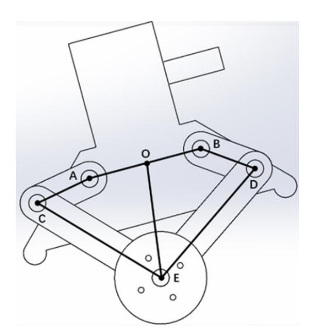

图 2: 五连杆

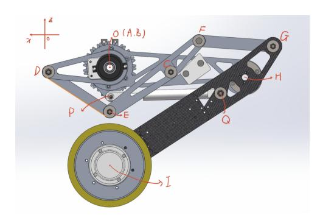

图 3: 相似五连杆

我们采用的串联结构是 25 交哥开源的串联腿结构,即相似五连杆,使用五连杆的 解算方式即可,需注意在实际计算中 A 、O 、B 三点重合,代入的是相似后得到的大 的大腿腿长(OH)与小腿腿长(HI)。

五连杆的正逆运动学以及虚拟腿模型见下图(摘自队内文档)。

**正运动学(已知  $\alpha_1, \alpha_2$ , 求取  $h, \psi, \alpha_3, \alpha_4$ )**

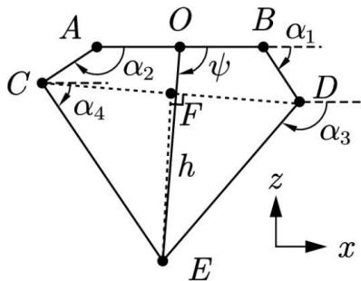

定义:  $p_i = [x_i \quad z_i]^T (i \in \{A, B, C, D, E, F\})$  为五连杆节点及辅助节点的在  $xOz$  平面投影的坐标。(默认坐标与向量具有相同表达形式与运算方法)

定义:  $atan2(\vec{v})$  用于计算向量  $\vec{v} = [x \quad z]^T$  与  $x$  轴的夹角。(注意与代码中  $atan2$  的区别)

先解算  $A, B, C, D, E$  五个节点的坐标:

$$p_A = \begin{bmatrix} -\frac{l_d}{2} & 0 \end{bmatrix}^T, p_B = \begin{bmatrix} \frac{l_d}{2} & 0 \end{bmatrix}^T,$$

$$p_C = \begin{bmatrix} -\frac{l_d}{2} + l_t \cos \alpha_2 & -l_t \sin \alpha_2 \end{bmatrix}^T, p_D = \begin{bmatrix} \frac{l_d}{2} + l_t \cos \alpha_1 & -l_t \sin \alpha_1 \end{bmatrix}^T$$

$$p_F = \frac{p_C + p_D}{2}, \vec{CD} = p_D - p_C, FE = \sqrt{l_i^2 - \frac{CD^2}{4}}$$

$$\vec{FE} = \frac{FE}{CD} \begin{bmatrix} 0 & 1 \\ -1 & 0 \end{bmatrix} \cdot \vec{CD}, p_E = \vec{FE} + p_F$$

由此可以求得所需变量:

$$h = \|p_E\|, \psi = atan2(p_E)$$

$$\vec{CE} = p_E - p_C, \vec{DE} = p_E - p_D$$

$$\alpha_3 = atan2(\vec{DE}), \alpha_4 = atan2(\vec{CE})$$

**2.2 逆运动学(已知  $h, \psi$ , 求取  $\alpha_1, \alpha_2$ )**

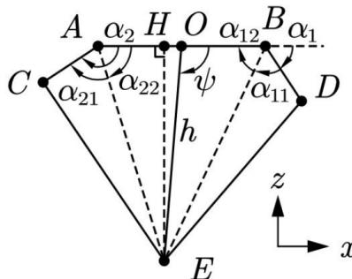

$$AH = \frac{l_d}{2} + h \cos \psi, BH = \frac{l_d}{2} - h \cos \psi, EH = h \sin \psi$$

$$AE = \sqrt{AH^2 + EH^2}, BE = \sqrt{BH^2 + EH^2}$$

$$\alpha_{11} = \arccos \frac{l_t^2 + BE^2 - l_i^2}{2l_t \cdot BE}, \alpha_{21} = \arccos \frac{l_t^2 + AE^2 - l_i^2}{2l_t \cdot AE}$$

$$\alpha_{12} = \arctan \frac{EH}{BH}, \alpha_{22} = \arctan \frac{EH}{AH}$$

$$\alpha_1 = \pi - \alpha_{11} - \alpha_{12}, \alpha_2 = \alpha_{21} + \alpha_{22}$$

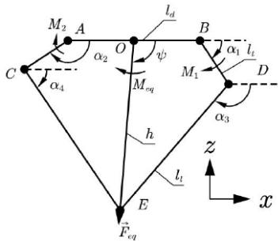

**2.3.1 雅克比矩阵计算**

由定义可得:

$$\begin{aligned}\psi &= \frac{\pi}{2} + \theta_{l,i} - \theta_b \quad (i = l, r) \\ h \cos \psi &= \frac{l_d}{2} + l_t \cos \alpha_1 + l_l \cos \alpha_3 = -\frac{l_d}{2} + l_t \cos \alpha_2 + l_l \cos \alpha_4 \\ -h \sin \psi &= -l_t \sin \alpha_1 - l_l \sin \alpha_3 = -l_t \sin \alpha_2 - l_l \sin \alpha_4\end{aligned}$$

对上式求变分可得:

$$\begin{aligned}-\sin(\theta_{l,i} - \theta_b) \delta h - h \cos(\theta_{l,i} - \theta_b) \delta \theta_{l,i} + h \cos(\theta_{l,i} - \theta_b) \delta \theta_b &= -l_l \sin \alpha_3 \delta \alpha_3 - l_t \sin \alpha_1 \delta \alpha_1 = -l_l \sin \alpha_4 \delta \alpha_4 - l_t \sin \alpha_2 \delta \alpha_2 \\ \cos(\theta_{l,i} - \theta_b) \delta h - h \sin(\theta_{l,i} - \theta_b) \delta \theta_{l,i} + h \sin(\theta_{l,i} - \theta_b) \delta \theta_b &= l_l \cos \alpha_3 \delta \alpha_3 + l_t \cos \alpha_1 \delta \alpha_1 = l_l \cos \alpha_4 \delta \alpha_4 + l_t \cos \alpha_2 \delta \alpha_2\end{aligned}$$

经整理可得:

$$\begin{aligned}\delta \alpha_1 &= -\frac{\sin(\alpha_3 - \theta_{l,i} + \theta_b) \delta h - \cos(\alpha_3 - \theta_{l,i} + \theta_b) h \delta \theta_{l,i} + \cos(\alpha_3 - \theta_{l,i} + \theta_b) h \delta \theta_b}{l_t \sin(\alpha_1 - \alpha_3)} \\ \delta \alpha_2 &= -\frac{\sin(\alpha_4 - \theta_{l,i} + \theta_b) \delta h - \cos(\alpha_4 - \theta_{l,i} + \theta_b) h \delta \theta_{l,i} + \cos(\alpha_4 - \theta_{l,i} + \theta_b) h \delta \theta_b}{l_t \sin(\alpha_2 - \alpha_4)} \\ \delta \alpha_3 &= \frac{\sin(\alpha_1 - \theta_{l,i} + \theta_b) \delta h - \cos(\alpha_1 - \theta_{l,i} + \theta_b) h \delta \theta_{l,i} + \cos(\alpha_1 - \theta_{l,i} + \theta_b) h \delta \theta_b}{l_l \sin(\alpha_1 - \alpha_3)} \\ \delta \alpha_4 &= \frac{\sin(\alpha_2 - \theta_{l,i} + \theta_b) \delta h - \cos(\alpha_2 - \theta_{l,i} + \theta_b) h \delta \theta_{l,i} + \cos(\alpha_2 - \theta_{l,i} + \theta_b) h \delta \theta_b}{l_l \sin(\alpha_2 - \alpha_4)}\end{aligned}$$

求解前两式, 可得:

$$\begin{bmatrix} \dot{h} \\ \dot{\psi} \end{bmatrix} = J \cdot \begin{bmatrix} \dot{\alpha}_1 \\ \dot{\alpha}_2 \end{bmatrix}$$

其中

$$J = \begin{bmatrix} -\frac{l_t \sin(\alpha_1 - \alpha_3) \sin(\psi - \alpha_4)}{\sin(\alpha_3 - \alpha_4)} & \frac{l_t \sin(\alpha_2 - \alpha_4) \sin(\psi - \alpha_3)}{\sin(\alpha_3 - \alpha_4)} \\ -\frac{l_t \sin(\alpha_1 - \alpha_3) \cos(\psi - \alpha_4)}{h \sin(\alpha_3 - \alpha_4)} & \frac{l_t \sin(\alpha_2 - \alpha_4) \cos(\psi - \alpha_3)}{h \sin(\alpha_3 - \alpha_4)} \end{bmatrix}$$

**2.3.2 关节空间力(矩)转换到工作空间力(矩)(已知  $M_1$ 、 $M_2$ , 求  $F_{eq}$ 、 $M_{eq}$ )**

$$\begin{bmatrix} F_{eq} \\ M_{eq} \end{bmatrix} = J^{-T} \cdot \begin{bmatrix} M_1 \\ M_2 \end{bmatrix}$$

**2.3.3 工作空间力(矩)转换到关节空间力(矩)(已知  $F_{eq}$ 、 $M_{eq}$ , 求  $M_1$ 、 $M_2$ )**

$$\begin{bmatrix} M_1 \\ M_2 \end{bmatrix} = J^T \cdot \begin{bmatrix} F_{eq} \\ M_{eq} \end{bmatrix}$$

# 10.2 轮心速度与底盘速度

串联腿构型下轮编码器安装在后腿连杆上,其读数是相对连杆的角速度,因此轮心 线速度必须补偿连杆自身的旋转:

$$\dot{s}_i = \left( \dot{\theta}_{w,i} + \dot{\alpha}_{4,i} + \dot{\theta}_b \right) \frac{D_w}{2}, \quad (76)$$

其中 α˙ 4,i 为后连杆的绝对角速度。

为了做过坎检测,还需要腿末端速度,即消除了腿长伸缩与摆动以及机体俯仰带来 的虚假速度:

$$\dot{s}_{e,i} = \dot{s}_i - \dot{l}_i \sin \theta_{l,i} - l_i \dot{\theta}_{l,i} \cos \theta_{l,i} - \dot{\theta}_i h_c \cos \theta_b, \quad (77)$$

其中 hc 为机体质心高度。s˙e,i 再经差分得到腿末端加速度 s¨e,i,是触碰5cm坎的判据之 一。

## 10.3 IMU 姿态解算与杆臂补偿

俯仰角、滚转角与三轴角速度由 IMU 的姿态解算给出。姿态解算采用 Mahony 互 补滤波(滤波系数取 kp = 0.2、ki = 0)。

杆臂效应必须要补偿。本机底盘板的 IMU 安装在底盘,因为云台的转动会导致机 体质心相对 IMU 安装位置存在一个随 yaw 电机角度周期性变化的杆臂向量(粗略近似 的结果)。

即杆臂在水平面内随云台旋转、竖直分量基本固定。测量点加速度与质心加速度满 足刚体运动学关系

$$a_{com} = a_{imu} + \alpha \times d + \omega \times (\omega \times d) + 2\omega \times \dot{d} + \dot{d}, \quad (78)$$

右侧四项依次为切向加速度、向心加速度、科里奥利加速度与杆臂自身的相对加速度。 其中 α 为机体角加速度,由角速度经一阶差分滤波得到; d˙ , d¨ 由杆臂向量差分得到。

不做这项补偿的后果挺严重的。比如说在小陀螺时没有引入该补偿,就会导致 IMU 测到向心加速度,然后底盘速度的卡尔曼滤波得到的速度就出错了。对于需要 导航的哨兵而言,这个问题更为严重,因此一定要进行补偿。

### 10.4 机体加速度投影

IMU 输出的加速度处于机体坐标系,需要用俯仰、滚转角旋转到近似世界系:

$$a_x = c_p a_x^b + s_p s_r a_y^b + s_p c_r a_z^b, \quad (79)$$

$$a_z = -s_p a_x^b + c_p s_r a_y^b + c_p c_r a_z^b - g, \quad (80)$$

其中 c, s 分别为对应角的余弦、正弦。ax 用于速度卡尔曼滤波的加速度观测,在机体 上/下斜坡时 ax 是不能反应机体在运动方向上的加速度的,不过影响不大,况且新赛季 地形删掉了飞坡,这一套完全可以继续使用的。

# 10.5 底盘速度卡尔曼滤波

底盘速度是受到了玺佬在知乎发的文章《轮腿倒立摆机器人运动速度估计》的启发 而优化设计的。

轮速解算的速度受到齿隙、打滑(踩到小/大弹丸)的噪声影响(高频噪声大但无 漂移),而加速度积分含有零偏漂移(低频存在漂移,高频噪声已经被滤掉),两者在 频域上正好互补。因此设计一个三维状态的卡尔曼滤波器,把加速度计零偏也作为状态 一起估计出来,以提高速度估计的准确性。

状态与过程模型 取

$$\boldsymbol{x}_{kf} = \begin{bmatrix} \dot{s} \\ a \\ b \end{bmatrix}, \quad (81)$$

其中 s˙ 为底盘前进速度、a 为真实前向加速度、b 为加速度计零偏。过程模型假设加速 度在一个控制周期内为随机游走、零偏为常值:

$$\mathbf{x}_{kf}(k+1) = \begin{bmatrix} 1 & \Delta t & 0 \\ 0 & 1 & 0 \\ 0 & 0 & 1 \end{bmatrix} \mathbf{x}_{kf}(k) + \mathbf{w}(k), \quad \mathbf{w} \sim \mathcal{N}(\mathbf{0}, Q), \quad (82)$$

$$Q = \begin{bmatrix} \frac{\Delta t^4}{4} q & \frac{\Delta t^3}{2} q & 0 \\ \frac{\Delta t^3}{2} q & \Delta t^2 q & 0 \\ 0 & 0 & \Delta t q_b \end{bmatrix}, \quad q_b \ll q, \quad (83)$$

零偏的过程噪声取得远小于加速度的过程噪声,这样滤波器就把持续存在的偏差归到 b 上、把快速变化的部分归到 a 上,实现零偏与真实加速度的可分离。

滤波器参数 机器人实际参数(控制周期 ∆t = 1 ms):

| $q = 3000,$ | $q_b = 0.1,$ | $R = \text{diag}(10, 3),$ | $P_0 = I,$ | $x_0 = \mathbf{0},$ | (84) |
|-------------|--------------|---------------------------|------------|---------------------|------|
|             |              |                           |            |                     |      |

代入 ∆t 后数值为

$$Q = \begin{bmatrix} 7.5 \times 10^{-10} & 1.5 \times 10^{-6} & 0 \\ 1.5 \times 10^{-6} & 3.0 \times 10^{-3} & 0 \\ 0 & 0 & 1.0 \times 10^{-4} \end{bmatrix}. \quad (85)$$

观测模型 观测为两路:轮速解算得到的速度、以及 IMU 投影得到的前向加速度(后 者等于真实加速度加零偏):

$$\mathbf{z}(k) = \begin{bmatrix} \dot{s}_{wheel} \\ a_{imu} \end{bmatrix} = \underbrace{\begin{bmatrix} 1 & 0 & 0 \\ 0 & 1 & 1 \end{bmatrix}}_H \mathbf{x}_{kf}(k) + \mathbf{v}(k), \quad \mathbf{v} \sim \mathcal{N}(\mathbf{0}, R), \quad (86)$$

其中

$$\dot{S}_{wheel} = \frac{\dot{s}_{e,l} + \dot{s}_{e,r}}{2}, \quad a_{imu} = a_x. \quad (87)$$

H 的第二行是 [0 1 1] ,即零偏可观的来源。加速度计读到的是 a + b,而速度观测独立 地约束了 a 的积分,两者联立就能够把 b 分离出来。标准卡尔曼递推(预测—增益— 更新)此处不再赘述,相信借助强大的 AI工具花费几分钟就能写出很好的卡尔曼滤波 器。

观测的条件切换 这也是本滤波器的小创新点之一。腾空时轮子空转,s˙wheel 完全失真, 若照常送入滤波器会把速度估计彻底带偏。处理方式是在空中人为构造一个与预测一 致的观测:

$$\dot{s}_{wheel} \leftarrow \begin{cases} \frac{\dot{s}_{e,l} + \dot{s}_{e,r}}{2}, & \text{触地(Mature、Jump 的预压与起跳阶段),} \\ \hat{s}(k) + \hat{a}(k) \Delta t, & \text{腾空(Flight、上台阶、Jump 的收腿与空中阶段).} \end{cases} \quad (88)$$

第二式使观测残差恒为零,滤波器在空中自然退化为纯惯性推算(sˆ˙ 按估计加速度积 分),既不需要在代码里切换滤波器结构,也不会因为改动 R 而引起协方差跳变。落地 后残差重新变为有效值,滤波器按正常增益收敛回轮速,收敛时间常数由 R 与 Q 之比 决定。

Dead 状态下滤波器与所有位置、速度累积量一并复位(xkf ← 0、协方差重置), 避免长时间静止时零偏估计漂走。只有 Mature、Flight、Jump、上台阶这些需要速度 反馈的模式使用滤波值 sˆ˙,其余模式直接使用原始解算值,避免滤波滞后干扰位置环。 位置由滤波后的速度积分得到:

$$s(k+1) = s(k) + \hat{s}(k) \Delta t. \quad (89)$$

#### 10.6 支持力估计

按照玺佬的知乎文章来设计的,万分感谢玺佬,他的很多文章对我而言是不可或缺 的启蒙教材,没有那些文章我不知道要多久才能入门平衡机器人。

此处贴出完整文章超链接,大家请自行查阅。如果安装了弹簧需要在计算前先扣除 弹簧补偿的力矩再计算。 <https://zhuanlan.zhihu.com/p/563048952>

# 11 检测层

状态机的所有切换都由检测层给出的布尔事件驱动。其中过坎的检测与执行因为 内容较多且相对独立,单独放在第 [14](#page-47-1) 章。

所有检测都遵循同一套工程原则:判据大部分取"与"降低误检、事件用计数器消 抖、在不适用的模式中直接禁用。任何单一阈值都有可能在某些工况下误触发,而一次 误触发意味着机器人在高速运动中被强行切入一个特种动作,后果通常是倒地。

## 11.1 触地与离地检测

离地判据 以支撑力估计为主。记单腿静态承载

$$F_{N,0} = \left( m_{leg} + m_{wheel} + \frac{1}{2}m_b \right) g, \quad (90)$$

则第 i 腿的离地判据为

| $F_{N_i} < k_{low,i} F_{N_0},$ | $k_{low} = \{0.2, 0.2\},$ | (91) |
|--------------------------------|---------------------------|------|
|                                |                           |      |

并要求该条件连续成立时间超过 Tof f:

$$T_{off} = \begin{cases} 20 \text{ ms}, & \text{一般模式}, \\ 100 \text{ ms}, & \text{小陀螺模式}. \end{cases} \quad (92)$$

小陀螺下放宽到 100 ms,是因为旋转带来的离心与侧向载荷转移可能会让支撑力估计 周期性掉落到门限以下。

左右两腿的系数是可以略有差异的,用于补偿装配与弹簧预紧的不对称。两侧弹簧 的预紧量与关节的静摩擦不可能完全一致,弹簧补偿的不好也会造成误差,这个需要大 家自己测试后填写合适的数值。

触地判据 没有用支持力恢复。这里采用两条并联判据,满足其一并持续 10 ms 即判触 地:

| $\underbrace{\dot{l}_i < -0.05 \text{ m/s}}_{\text{判据 A: 腿长速度反向}} \vee \underbrace{(l_i < l_{max} - 0.03) \wedge (i^{peak} > 0.10) \wedge (i^{peak} - \dot{l}_i > 0.15)}_{\text{判据 B: 空中伸腿峰值回落}}, \quad (93)$ |  |
|---------------------------------------------------------------------------------------------------------------------------------------------------------------------------------------------------------------|--|
|---------------------------------------------------------------------------------------------------------------------------------------------------------------------------------------------------------------|--|

其中 ˙ l peak i 为本次腾空过程中记录的腿长伸展速度峰值(进入腾空时清零,逐拍记录最 大值)。

两条判据针对的是两种不同的落地形态。判据 A 对应腿已伸到位、落地被压缩, 因伸腿的力小于整车需要的支持力,导致腿长速度反向;判据 B 对应空中主动伸腿过 程中触地,此时腿仍在伸长、速度不会立刻反向,只是被地面压制,表现为伸展速度从 峰值明显回落。若只用判据 A,主动伸腿落地的情形可能会存在漏检,导致机器人姿态 失衡。

触地检测的启用条件为处于 Mature、或 Flight、或 Jump 的空中阶段。其余状态 下该判据的物理含义不成立。

# 11.2 异常检测与分级

异常检测是安全体系的核心,就是防止机器人失控后还在尝试用 LQR 控制机体姿 态造成更大的机械损害。它产生一个分级枚举

| $\mathcal{L} \in \{\text{AllStable, Warn, Dangerous, Dead, OverTurn}\},$ | (94) |
|--------------------------------------------------------------------------|------|
|--------------------------------------------------------------------------|------|

由两个带滞环的计数器与若干独立标志共同决定。

滞环计数器 设 C1 为一般异常计数、C2 为严重异常计数, A1, A2 为对应的判据集合, 则

$$C_j(k) = \text{clamp} \left( C_j(k-1) + \begin{cases} +1, & \forall A_j \text{ 成立}, \\ -1, & \text{否则} \end{cases}, 0, C_{j,max} \right), \quad j = 1, 2. \quad (95)$$

成立加一、不成立减一可让阈值附近的抖动不能通过反复清零来规避升级。

一般异常判据集 A1 对仍有可能挽救的量取逻辑或:

|                                                                                 |  |  |  |  |  |
|----------------------------------------------------------------------------------------------|---------------|---------------|---------------|---------------|---------------|
| $A_1 : a_z < 0.1g$                                                                           | (接近失重或已倒地)    |               |               |               |               |
| $\vee  \theta_{l,i}  > 55^\circ$                                                             | (腿摆角过大)       |               |               |               |               |
| $\vee  \dot{\theta}_{l,i}  > 540^\circ/s$                                                    | (腿摆角速度过大)     |               |               |               |               |
| $\vee  \dot{\theta}_b  > 4 \text{ rad/s}$                                                    | (俯仰角速度过快)     |               |               |               |               |
| $\vee  \theta_b  > 45^\circ \vee  \gamma  > 45^\circ$                                        | (俯仰/滚转过大)     |               |               |               |               |
| $\vee  \theta_{l,l} - \theta_{l,r}  > 60^\circ$                                              | (两腿劈叉)        |               |               |               |               |
| $\vee  \dot{s}  > 6 \text{ m/s}$                                                             | (超速)          |               |               |               |               |
| $\vee  T_{wl,i}  > 6 \text{ N} \cdot \text{m} \vee  T_{bl,i}  > 50 \text{ N} \cdot \text{m}$ | (LQR 输出饱和)    |               |               |               |               |
| $\vee (l_i > l_{th} \wedge  \theta_{l,i}  > \theta_{th})$                                    | (高重心 + 大倾角组合) |               |               | (96)          |               |

其中 γ 为滚转角。最后一条组合判据主要会出现在上台阶失控与跳高地失控的情况, 表现是腿比较长,前导轮触地,车会不受控制的冲出去。

严重异常判据集 A2 对基本无法挽救的量取逻辑或,阈值更严。具体数值不做详细说 明(实车上就是上面的值取更极端一些),请大家自行测试。

分级判定 以 ∆t 为控制周期,判定规则为

| $\mathcal{L} = \text{Dead} :$ | $ \alpha_i  > 90^\circ \vee  \theta_{i,l}  > 80^\circ \vee  \dot{\theta}_j  > 4\pi \text{ rad/s} \vee \text{isnan}(\cdot),$ | (97) |
|-------------------------------|-----------------------------------------------------------------------------------------------------------------------------|------|
|                               |                                                                                                                             |      |

| $\mathcal{L} = \text{Dangerous} : C_1\Delta t > 0.30 s \vee C_2\Delta t > 0.05 s$ | (98) |
|-----------------------------------------------------------------------------------|------|
|-----------------------------------------------------------------------------------|------|

| $\mathcal{L} = \text{Warn} : C_1 \Delta t > 0.20 \text{ s} \vee C_2 \Delta t > 0.03 \text{ s},$ | (99) |
|-------------------------------------------------------------------------------------------------|------|
|-------------------------------------------------------------------------------------------------|------|

$$\mathcal{L} = \text{OverTurn} : c_{ot} \Delta t > 0.6 \text{ s}, c_{ot} \text{ 由 } a_z < 0.3 \text{ g 驱动 (非翻身阶段)} \cdot (100)$$

致命等级立即触发,不做任何消抖。

两级并联(快触发的严格条件 + 慢触发的宽松条件)兼顾了灵敏度与鲁棒性:轻 微扰动需要持续 0.2 ∼ 0.3 s 才升级,而剧烈事故在 30 ∼ 50 ms 内就可以触发重启。

禁用窗口 异常检测在以下情况下完全关闭:不在成熟或飞行模式与处于恢复流程中。 飞行模式使用一套独立的更宽阈值,因为空中本来就没有支撑、姿态变化大。

#### 11.3 台阶检测

上台阶是主动动作,不太能接受误触发,因此判据设计成必要条件 ∧ 主判据 ∧ 至 少一条辅助判据的三重结构:

$$\mathcal{N}_{step} : (\text{mode} = \text{Mature}) \wedge (\bar{h}_{chassis} > 0.30 \text{ m}) \wedge \text{step\_allowed}, (101)$$

$$\mathcal{P}_{step} : (|\theta_b| > 6^\circ) \wedge (|\theta_{t,l}| > 14^\circ \vee |\theta_{t,r}| > 14^\circ), \quad (102)$$

Sstep :

˙θb| > 10◦

/s 

∨ (|s˙ref − s˙| > 0.2 ∧ |s˙ref | > 0.2)

| $\vee ( \theta_b  > 12^\circ) \vee ( \theta_{i,i}  > 20^\circ),$ | (103) |
|------------------------------------------------------------------|-------|
|------------------------------------------------------------------|-------|

最终事件为 Nstep ∧ Pstep ∧ Sstep 并消抖 20 ms。

主判据就是轮子被台阶顶住后,轮心无法前进而机体因惯性继续前移,于是腿被迫 后摆(|θl,i| 增大)同时机体下压(|θb| 增大)。

辅助判据中速度跟踪误差这一项是比较关键的区分,被台阶挡住时,指令速度不为 零却跟不上, |s˙ref − s˙| 显著增大。

### 11.4 障碍测距与跳跃触发窗口

跳跃需要在合适的距离起跳,距离由前向测距传感器给出。原始测距值需要经过 处理后使用。机器人使用的测距模块是 MS53L2M ,很小一个,但是能够测量的范围 不算很大,说明书上写的范围是 8m,但在实际环境测下来 1.8m 外都不是很稳定了, 貌似这种很小的测距都这样,很不稳定, 27 赛季大家也许可以选择功率更大的测距模 块。之前也试过用只用哨兵的激光雷达测距,其实效果还挺好的,不过里程计只能做到 20Hz,可能对于跳跃而言有点慢,但调的好或者跳的数值高的话也完全够用了。

有效量程 只接受

| $d \in [0.30, 1.75]$ m. | (104) |
|-------------------------|-------|
|-------------------------|-------|

地面误检剔除 机器人俯身时测距头会指向地面,读数是一个看起来合理的近距离值, 需要大家自行剔除,不然会引起误判导致机器人加速时还没到就跳了起来,然后掉进 "落凤坡"。不过 27 赛季没有飞坡了,跳过洞还要手跳,这下只能压力操作手了。用激 光雷达来测距就没有这个烦恼了。

双传感器一致性与强度 两个测距头必须互相印证:

| $ d_1 - d_2  < 0.30$ m | $\wedge$ | $\min(I_1, I_2) > I_{min}$ | (105) |
|------------------------|----------|----------------------------|-------|
|------------------------|----------|----------------------------|-------|

其中 I 为回波强度。强度过低说明目标表面反射不足(或根本没有目标),读数不可 信。

速度相关的起跳窗口 速度越快,起跳点必须越远。触发窗口的上下界均为速度的一次 函数:

| $d_{up}(v) = b_u v + c_u,$ | $b_u = 0.58, c_u = 0.30,$ | (106) |
|----------------------------|---------------------------|-------|
|----------------------------|---------------------------|-------|

| $d_{low}(v) = b_l v + c_l$ | $b_l = 0.40, c_l = 0.10,$ | (107) |
|----------------------------|---------------------------|-------|
|----------------------------|---------------------------|-------|

上界再整体限幅到 [0.5, 1.92] m(测距距离为两测距取平均值加机体长度的一半,即判 据用的距离指示机体中心到墙壁的距离)。触发条件为

$$d \in [d_{low}(|\dot{s}|), d_{up}(|\dot{s}|)] \quad \wedge \quad |\dot{s}| > \dot{s}_{min}, \quad (108)$$

其中 s˙min = 1.0 m/s。低速起跳跳不远,效果类似在原地跳了一下,所以需要低速阈 值。计时消抖 25 ms。大家测试时,建议多拍慢动作视频,记录起跳速度、起跳点、最 高点、35cm等高线等数据用于计算填写数值。当然一定要先搞明白测距的特性,不然 会吃很多亏。

# 11.5 超时保护

所有特殊动作都有硬性超时,超时即置位 is robot overtime ,被视为异常并强 制回到失能状态,由异常锁统一处理。判定统一写成处于该模式的时间 > 门限,按模 式取值如下:

| 模式       |   |    | 门限取值 |
|----------|---|----|------|
| Flight   | 1 | 3  | s    |
| Jump     | 2 | 0  | s    |
| Step     | 3 | 0  | s    |
| Recovery |   | 12 | 0 s  |

超时保护是为了防止机器人在特殊动作中失控后卡状态机导致机器人一直不动,触 发后会进入恢复模式。

# 12 功率模型与功率控制实现

# 12.1 稳态功率模型

常规的功率控制思路是在力矩下发环节做逐电机的功率反解与缩放,但轮腿机器 人的力矩指令由 LQR 直接给出,对力矩的后处理很容易破坏状态反馈的闭环特性(缩 放轮力矩相当于改变了 LQR 增益,可能直接导致失稳)。而将力矩输出分为维持平衡 力矩+运动力矩的方式效果也很差,因为建模时没有考虑摩擦力,因此限制的结果是使 期望速度/角速度趋向于当前速度/角速度,导致超功率后无法进行刹车等情况,不符合 实际需求。

由于底盘有超级电容,电容能够在急加速、落地冲击这类高频瞬态下提供功率兜 底,真正需要约束的是长时间维持的稳态功率。因此本系统把功率控制上移到速度指令 层。

这样一来,加速时的功率峰值由超级电容提供,而稳态已经受到约束,即使加速的 功率峰值过大也没有关系,因为如果超级电容低于收敛值时,可用功率会小于裁判系统 上限,使机器人的功率迅速降低,开始给超级电容充电。

完整辨识出的功率模型实际上包含 12 项(见附件)。但使用时只保留与速度和角 速度相关的 6 项:

$$P_{pred} = c_0 + c_5|v| + c_6|\omega| + c_7v^2 + c_8\omega^2 + c_{11}|v\omega|. \quad (109)$$

其中 v 为底盘前进速度、ω 为偏航角速度。c0 是静止时的维持功率。

我进行过多次辨识,存在 |vω| 的系数为0的辨识结果,也就是说速度和角速度对功 率的影响可看成是解耦的,可以进行分别限制。大家要注意在调过Q矩阵R矩阵后最好 都进行一次功率模型系统辨识,辨识时最好在贴近比赛的地胶上进行,并且装入足够的 弹丸,记录多种不同工况下的数据,完成后填入最新的参数。

# 12.2 可用功率的计算

裁判系统给出底盘功率上限与缓冲能量,超级电容另有自身的剩余能量。控制器每 周期按以下逻辑确定本拍允许的稳态功率上限:

$$P_{max} = \text{clamp}(P_{referee} + k_{slope} (E_{remain} - E_{conv}), P_{min}, P_{ref_{max}}), \quad (110)$$

以裁判系统功率上限为基准,按剩余能量相对收敛能量" Econv 的偏差线性地上浮或 下压。剩余能量高于 Econv 时允许超功率运行(消耗超电),低于时压到裁判上限以下 (回充超电),Econv 即缓冲能量的稳态工作点。斜率 kslope 取 2 ∼ 3 量级,相当于一个 纯比例的能量控制器,其闭环特性是缓冲能量一阶收敛到 Econv。

各参数的取值随工况调度:

- Pref max(允许的最大超功率)为裁判上限加一个上浮量:常规为 +100W,加速 模式下为 +150W,小陀螺下降到 +70W (小陀螺是持续高功耗动作,允许的瞬 时超发必须收紧,否则缓冲很快耗尽);
- Pmin 取裁判上限的 0.7 倍,因为完全断功率会直接失去平衡;
- Econv 取 50(即超电剩余能量占总容量的百分比为 50%);
- 危险能量线:剩余能量低于 5 J 时 Pmax 直接置零;

# 12.3 降额系数的求解与施加

若 Ppred ≤ Pmax 则不做任何处理(λ = 1)。否则对速度指令求同比例缩放系数 λ ∈ [0, 1],令缩放后的预估功率恰好等于 Pmax。把 v → λv、ω → λω 代入模型:

$$A = c_7 v^2 + c_8 \omega^2 + c_{11} |v||\omega|, \quad (111)$$

$$B = c_5|v| + c_6|\omega|. \quad (112)$$

$$B = c_5|v| + c_6|\omega|, \quad (112)$$

$$B = C_2[0] \cap C_6[0], \quad (112)$$

$$C = c_0 - P_{max}, \quad (113)$$

即得一元二次方程 Aλ2 + Bλ + C = 0,取正根

$$\lambda = \frac{-B + \sqrt{B^2 - 4AC}}{2A}. \quad (114)$$

实现上需要处理三类退化:A 与 B 同时接近零(模型只剩常数项,此时若 c0 > Pmax 则无解,取 λ = 0,否则取 1); A 接近零(退化为线性方程 λ = −C/B);判别式为负 (无正实根,取 λ = 0)。最终结果限幅到 [0, 1] 后同时乘到平移与旋转速度指令上。

对 v 与 ω 同比例缩放,确保操作手的手感是线性的。

### 12.4 功率控制的使能条件

速度指令降额只在姿态正常时启用,确保姿态已经很危险时,机器人能够先站稳。 否则此时限功率会导致倒地。

# 12.5 功率限制物理模型

因为上述的功率限制系统表现的相当不错,场上基本没有超过功率,所以我没有深 究过物理模型。不过后来在MATLAB中考虑滚动摩擦力实际上包括库仑摩擦(与速度方 向相反,大小恒定)与粘性摩擦 (与速度成正比),大致仿真了一下,与实际系统辨识的 结果还是接近的。如果大家感兴趣可以继续研究下去,具体实现在仿真代码的 sim 文 件夹中的仿真中(运行前注意不要出现中文路径),当然轮电机配合减速箱的相关参数 需要自行调整。

## 12.6 优化点

因为超级电容控制板可以采样输出功率,所以可以考虑在在线辨识功率模型(附件 中的完整模型)后,使用在线辨识的功率模型来计算降额系数,这样可以更精确的控制 功率,避免过度降额。毕竟辨识更新频率要求不高,要节省算力可以在上位机中进行。

# 13 控制系统状态机执行架构

串联腿机器人用传统控制最难受的地方就在于做不同动作时需要设计不同的状态 机,而且不同动作之间状态机的检测层可能会互相干扰,导致执行器被多个动作同时争 夺。所以要设计出足够清晰的状态机架构,避免不同动作之间的干扰。

底盘的行为逻辑由一个三层状态机组织:外层是电源状态,中层是控制模式(决 定机器人正在做什么动作),内层是每个模式自己的子阶段(决定动作进行到哪一步)。 与控制模式并行的还有一个工作模式维度(决定底盘与云台的相对关系)。分层的核心 目的是让每个复杂动作在自己的子状态机内部闭环,外部只能通过允许/不允许进入和 强制打断两个接口干预,从而彻底避免多个动作互相抢夺执行器。

# 13.1 每周期的执行顺序

底盘任务每 1 ms 被调度一次,实现上分为决策与执行两个入口,二者串行调用, 顺序即优先级:

- 1. 数据更新:更新工作节拍、云台通信、电机反馈、电机速度滤波、IMU、测距、 超电与缓冲电容状态,随后解算虚拟腿状态、整机十维状态、支持力估计与状态 一步预估;
- 2. 电源状态更新:决定系统是否具备工作条件;
- 3. 检测状态更新:检测触地/离地、异常等级、打滑、跳跃窗口、动作是否超时、是 否触碰台阶、过坎检测与过坎叠加维护;
- 4. 锁存历史模式:把当前控制模式与工作模式分别存入上一拍的历史变量,用于识 别模式刚切换这一沿事件;
- 5. 事件生成:把检测结果分类为正常、异常锁定、需要离地处理、需要上台阶、需 要跳跃四类事件标志;
- 6. 优先级仲裁:把所有事件与操作手/导航指令归入唯一的优先级等级,按先命中者 胜的顺序早返回;
- 7. 目标模式解算:由优先级等级唯一确定目标控制模式;
- 8. 状态转移:依次检查原子动作锁、同态过滤、执行退出清理、更新历史模式、按 路由规则写入当前控制模式;
- 9. 工作模式切换:在允许条件下切换底盘朝向模式;
- 10. 执行:先算机械限位速度降额系数,再按电源状态与控制模式分发到对应模式的 执行分支,由子状态机计算参考量与力矩并写入电机指令。

把"检测—事件—仲裁—转移—执行"分成互不重叠的阶段,保证了同一拍内不会出 现刚切换模式又立刻被下一个判据改回去的震荡。事件标志在第 5 步一次性冻结,第 6∼8 步只读不写,所有模式转移在一拍内只发生一次。

## 13.2 第一层:电源状态

- Dead:无供电(根据裁判系统判断)。所有输出为零。检测到供电则进入 Resurrection。
- Resurrection:已上电但尚不能工作。等待两个条件同时满足:云台 IMU 就绪、 以及所有电机在线并稳定持续 1 s。
- Working:正常工作,中层状态机开始运行。

### 13.3 第二层:事件生成

仲裁之前先有一层事件生成,它把上一节各检测器的连续量转换成四个布尔标志。 这一层的意义是把检测(信号处理)与决策(何时动作)解耦。

#### 异常锁定

sensor abnormal = (level ∈ {Dangerous, Dead, OverTurn}) ∨ overtime. (115)

该信号为真且当前未锁定时,置位 is abnormal lock 并记下起始节拍;锁定必须满 50 ms才允许解除。

需要飞行 只在 Mature 下更新:

need\_flight = 
$$\neg \text{on\_ground}_i \vee \neg \text{on\_ground}_i$$
. (116)

任一腿离地即成立。

#### 需要上台阶 先算共同条件

---

$$\text{step\_common} = (\text{mode} = \text{Mature}) \wedge \text{touch\_step} \wedge \neg \text{rev\_head} \wedge (\text{wm} \notin \{\text{Gyro}, \text{Sideway}\}),$$
(117)

再分别与两个功能开关相与得到 need onestep 与 need twostep 。

#### 需要跳跃

need jump = (mode = Mature) ∧ jump allowed ∧ (close2obs ∨ manual), (118)

# 13.4 第二层:优先级仲裁

中层的目标模式由一个明确的优先级表决定。仲裁函数用连续的早返回实现,先命 中者独占控制权:

- Highest:遥控器/键鼠急停,即 cmd lqr mode ref == Dead;
- Level1:异常锁定 is abnormal lock ;
- Level2:跳跃请求 is robot need jump ;
- Level3:飞行请求 is robot need flight ;
- Level4:上台阶请求 is robot need twostep 或 is robot need onestep ;
- Lowest:操作手/导航的常规模式指令(通常为 Mature)。

仲裁结果直接映射为目标模式:Highest 与 Level1 映射到 Dead; Level2 映射到 Jump; Level3 映射到 Flight; Level4 优先取 Twostep(两个标志同时成立时二级台阶胜出), 否则取 Onestep; Lowest 则采用操作手/导航指令本身。

优先级的排序本身就是安全逻辑,保护永远优先于动作,动作永远优先于操作 手/导航意图。

# 13.5 第二层:状态转移的合法性规则

仲裁给出目标模式后,转移还要经过三道检查。

(1) 强制打断权 只有 Highest 与 Level1 拥有强制打断权,可以在任何时刻、任何子阶 段把机器人切入 Dead。

(2) 原子动作锁 恢复、飞行、跳跃、上一级台阶、上二级台阶这五个模式都是原子动 作:一旦进入,除非其子状态机自己走到 Return 阶段,否则任何非强制请求都被直接 丢弃。这条规则能够避免动作执行到一半被新指令打断,机器人处于既非平衡态也非动 作终态的中间姿态,两套控制逻辑的参考量互相冲突。

(3) 同态过滤 若 lqr mode curr == lqr mode ref 则直接返回,不执行任何清理。 这一条必须放在原子锁之后、路由之前,否则各状态机的 Init 会被每拍反复执行,参 考量每拍重新锁存,动作永远无法推进。

#### (4) 转移路径约束 即使目标模式合法,路径也受限:

- 任何模式 → Dead:始终直接允许,同时置位云台失能标志;
- Dead → Mature:必须经过 Recovery后站起来;
- 特种动作只能从 Mature 进入;从其他模式请求特种动作时,先过渡回 Mature, 等下一拍重新仲裁。

退出清理 每次真正发生模式切换时,按当前模式统一执行:把当前模式的子阶段复位 为 Init、清零该模式的节拍计数,然后把历史模式向后推一格:

last last lqr mode ← last lqr mode , last lqr mode ← lqr mode curr . (119)

保留两级历史是因为某些动作的返回目标依赖来路:例如 Mature 的 Init 需要区分从 Recovery 来、从 Flight/Jump 来、从 Onestep 来,方便调试和处理。

# 13.6 第三层:Recovery(倒地恢复)子状态机

Recovery 是最复杂的子状态机,需要把任意姿态的机器人变成可平衡姿态。它有 五个工作阶段与一个交接阶段:

$$\text{Init} \rightarrow \begin{cases} \text{TurnOver} \\ (\text{可跳过}) \end{cases} \rightarrow \text{YawFront} \rightarrow \begin{cases} \text{Swing} \\ (\text{可跳过}) \end{cases} \rightarrow \text{DrawBack} \rightarrow \text{Return}. \quad (120)$$

Init 复位全部 PID 与参考量、清零恢复相关的全部计数与卡死标志、把两腿腿长参 考设为最长 lmax = 0.331 m。随后按竖向加速度(imu 的原始输出)分支:

$$\text{next} = \begin{cases} \text{YawFront, } a_z > 0.4 g & \text{(机体大致朝上),} \\ \text{TurnOver, } \text{otherwise.} & \end{cases} \quad (121)$$

倒地后 IMU 的姿态解算可能已经跨过奇异区、四元数收敛到错误分支,而重力方 向的加速度投影始终可靠,所以用竖向加速度进行判断。

TurnOver(翻身) 动作:把两条腿腿长参考设为最长 lmax,使两腿同步向同一方向 旋转,方向为旋转后恰腿摆在后面对应的方向。要注意如果两腿初始摆角不同,要使两 腿同步,否则两腿不同步旋转可能导致机体无法翻过身来。执行期间强制使云台失能, 或者云台使用比较软的 PID 使云台在机体旋转过程中就摆正(该 PID 的限幅要比电机 最大输出力矩小很多,避免损害云台电机)。

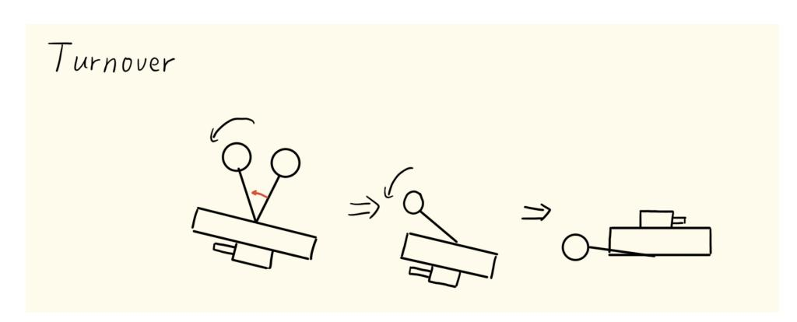

图 6: 翻身动作示意图

卡死处理:一般来说,安装 UWB 后,腿旋转时有可能与 UWB 支架卡住导致完 全卡死,所以需要检测卡死状态。若任一腿的机构角速度 |α˙ i | < 35◦/s,累加卡死计数; 一旦超过 600 ms,置位 is turnover stuck 、以当前实际角重新锁存起始角并清零计 数。该标志会将扫掠方向反转。

退出:用一个带惩罚的计数器判定翻身成功

$$N_{over} \leftarrow \begin{cases} N_{over} + 1, & a_z > 0.4g, \\ \lfloor N_{over}/2 \rfloor, & \text{otherwise,} \end{cases} \quad N_{over} \geq 100 \Rightarrow \text{YawFront.} \quad (122)$$

YawFront(使云台方向朝前/后) 这一阶段确定车头朝向,同时也避免腿在 Swing 阶段旋转时与云台卡住。按照就近原则根据电机角度将云台旋转到朝前/朝后即可。

Swing(摆腿到起立位) 动作:把两条腿旋转到起立预备角、腿长伸到最长 lmax,为 撑起机体做准备。两腿独立处理(各有自己的卡死标志、卡死计数与脱困子阶段)。

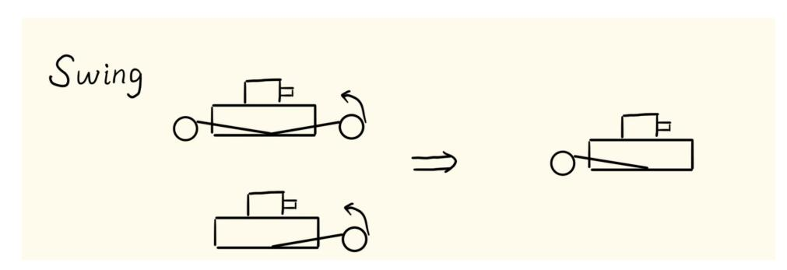

图 7: 摆腿动作示意图

卡死处理:判据为

$$\underbrace{l_i > 0.30 \text{ m}}_{\text{腿处于伸长状态}} \wedge \underbrace{|\dot{\theta}_{l,i}| < 15^\circ/\text{s}}_{\text{几乎不动}} \wedge \underbrace{|\dot{\theta}_{l,i} - \theta_{swing}| > 10^\circ}_{\text{没到位}}, \quad (123)$$

- BackToVertical:把腿长参考按 1.8 m/s 限速收到 l cmd min = 0.11 m,同时机构角以 180◦/s 转至垂直机体向上;进入垂直机体向上附近 10◦ 内后切到第二段;
- ToFinal:以 180◦/s 转向目标角。

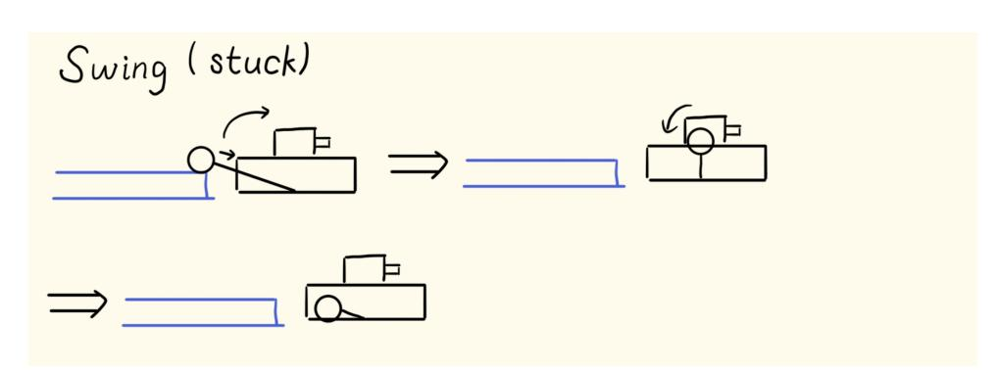

图 8: 摆腿卡死脱困动作示意图

退出:

$$(|\theta_{l,i} - \theta_{swing}| < 15^\circ) \forall i \wedge |\theta_b| < \theta_{swing}^{pitch} + 15^\circ \wedge |\gamma| < \gamma_{swing} + 10^\circ, \quad (124)$$

确保进行下一个动作收腿前机体的腿已经到位且 pitch 与 roll 均在可接受的范围内。

DrawBack(收腿站起) 动作:把两条虚拟腿摆角以 200◦/s 转到竖直向下、腿长以 1.2 m/s 收到最短 lmin = 0.10 m,机体被轮子撑起。

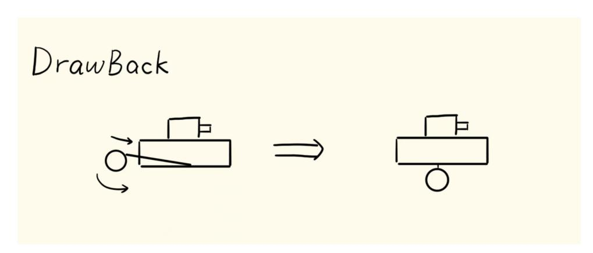

图 9: 收腿站起动作示意图

退出:六项全部成立

| $( l_i - l_{min}  < 0.05 \text{ m}) \forall i \wedge  l_i - l_r  < 0.04 \text{ m} \wedge ( \theta_{i,i}  < 15^\circ) \forall i$ | (125) |
|---------------------------------------------------------------------------------------------------------------------------------|-------|
| $\wedge  \theta_b  < 0.45 \text{ rad} \wedge  \gamma  < 20^\circ,$                                                              |       |

进入 Return。各项分别保证:腿已收短、两腿等长、腿已竖直(重心在轮轴正上方)、 俯仰与滚转已在 LQR 的线性化有效域内。

Return(交接) 置位 is recovery finish 、清除卡死标志、把高度指令设为当前腿 长的平均值,清零模式计数,然后做一次完整的状态复位:

- 两腿与整机的 pos、dpos 参考与实测全部清零;
- θ ref b ← 当前 IMU 俯仰;
- θ ref l , θref r ← 当前实际腿摆角;
- 复位速度卡尔曼滤波;
- 切入 Mature,工作模式与历史工作模式都置为 Depart(分离模式)。

# 13.7 第三层:Mature(稳态平衡)子状态机

Mature 只有 Init 与 Ctrl 两个阶段,它是唯一允许被其它模式打断、也是唯一允许 发起其它模式的枢纽,因此它的 Init 承担了全部对账工作, Ctrl 则是整个系统的主控 制回路,要调好车就要把 Ctrl 阶段处理好。

Init 先做无条件的部分。复位 PID、速度指令与位置参考清零、偏航角速度指令清 零、高度参考取当前两腿较小的腿长。位置清零。

随后按来路(last lqr mode )分支:

- 从 Recovery 来:清零全部位置、速度与航向参考(从 Depart 来则将航向参考 重新同步到当前实际航向),复位速度 KF;
- 从 Flight 或 Jump 来:置位落地标志 is landing 并设置落地缓冲计数 fly land tick = 300(即 300 ms);将速度参考同步至实际速度,位置参考同步至 Return 时记 录的位置差(需限幅)。
- 从 Onestep/Twostep 来:类似从 Flight 或 Jump 来,但不需要标志位和缓冲;

Ctrl(正常控制) 这是机器人绝大部分时间所处的状态。按代码中的实际顺序,每拍 做以下十件事:

(1) 增益掩码复位。先把 mature lqr gain 恢复为全一,保证上一拍的临时掩码 不会残留。

(2) 根据状态设置本拍增益掩码(详见输出链一节)。在异常等级为警告时把掩码 改写为

$$m_{warn} = \left[ \begin{array}{cccccccccc} 0 & 1 & 0 & 0 & 1 & 1 & 1 & 1 & 1 & 1 \end{array} \right], \quad (126)$$

有关指令只保留速度指令,使机器人在危险情况下能够主要维持平衡,保留速度辅助脱 困。

(3) 落地缓冲。若 fly land tick > 0 则把 mature lqr gain [0] = 0,即只跟速 度不跟位置,即掩码变为

$$\mathbf{m}_{land} = \begin{bmatrix} 0 & 1 & 1 & 1 & 1 & 1 & 1 & 1 & 1 & 1 \end{bmatrix}. \quad (127)$$

这个的用处可能不是很大,实际测试下来效果不明显。

(4) 增益矩阵在线插值。按当前左右腿长在 poly33 拟合曲面上求值,得到本拍的 K、AL、BL 与静态前馈 Ud。

(5) 参考量生成。

- 机体俯仰参考按 ˙θ max b = 3.0 rad/s 斜坡到零;
- 不加摆腿前馈时,两腿腿摆角参考按 ˙θ max l = 5.0 rad/s 斜坡到零;
- 过坎时叠加俯仰偏置(见过坎一章)。

腿摆角与俯仰参考均渐变到零而不是直接置零,是因为它是 LQR 的直接输入,阶跃会 产生一个大的腿部力矩尖峰,可能导致系统失控。

(6) 位置参考。由速度指令积分得到,但只在 |sref − s| < 1.0 m 时才积分,避免被 挡住时仍然在一直积分。

(7) 计算输出。按是否过坎选择掩码

$$m = \begin{cases} m_{bank} = \begin{bmatrix} 0 & 0 & 1 & 1 & 1 & 1 & 1 & 1 & 1 & 1 \\ \text{mature\_lqr\_gain\_,} & & & & & & & & & \\ & & & & & & & & & \end{cases}, \quad \text{任一腿正在过坎,} \quad (128) \quad \text{否则,}$$

然后依次完成 LQR 求解、轮力矩解算与关节力矩解算。注意只要有一条腿在过坎,两 条腿的位置与速度通道都被屏蔽。不过过坎掩码的效果也有待商榷,实际效果与全一的 区别不是很大。

# 13.8 第三层:Jump(主动跳跃)子状态机

跳跃是整个系统中能量最集中和失败代价最高的动作。它的子状态机共六个阶段:

Init 
$$\rightarrow$$
 PreCompress  $\rightarrow$  Jump  $\rightarrow$  Recovery  $\rightarrow$  Air  $\rightarrow$  Return. (129)

除强制打断(急停与异常锁)外没有任何回退分支。

跳跃的触发条件 跳跃请求位于优先级 Level2,其成立条件为四项的逻辑与:

$$\text{jump\_req} = \underbrace{(\text{mode} = \text{Mature})}_{\text{必须先处于平衡态}} \wedge \underbrace{(N_{\text{mature}} > N_{\text{stand}})}_{\text{已站稳}} \wedge \underbrace{\text{jump\_allowed}}_{\text{功能开关}} \wedge \underbrace{(\text{close2obs} \vee \text{manual})}_{\text{触发源}}. \quad (130)$$

跳跃形态由上层指定,共三种:

JumpPattern ∈ {JumpStep(跳台阶), JumpSlope(反飞坡), JumpBank(跳坎)}, (131)

JumpPattern 
$$\in \{\text{JumpStep} (\text{跳台阶}), \text{JumpSlope} (\text{反飞坡}), \text{JumpBank} (\text{跳坎})\}$$
, (131)

$$\tau_{jump} = \begin{cases} \tau_{step} = 20 \text{ N} \cdot \text{m}, & \text{JumpStep}, \\ \tau_{slope} = 30 \text{ N} \cdot \text{m}, & \text{JumpSlope}, \\ \tau_{bank} = 13 \text{ N} \cdot \text{m}, & \text{JumpBank}, \end{cases} \quad l_{air,max} = \begin{cases} 0.19 \text{ m}, & \text{JumpBank}, \\ 0.15 \text{ m}, & \text{其他}. \end{cases} \quad (132)$$

跳跃结束时(Jump/Return)会把当时的节拍记入 last jump tick ,用于实现跳 跃间隔冷却,避免连续跳跃导致的缓冲电容能量耗尽从而电机欠压失能。

Init(初始化) 触发:由状态转移写入本模式后的第一拍自动进入。

动作:复位全部 PID 的积分,锁存起跳瞬间的航向参考 ϕ jump ref 确保跳跃时的航向 不变。

退出:无条件,当拍即进入 PreCompress。

PreCompress(下压蓄能) 动作:把两条腿的腿长参考设为最短

$$l_{ref,i} = l_{min} = 0.10 \text{ m}, \quad (133)$$

同时保持完整的 Mature 式 LQR 平衡控制。

退出:两个条件之一成立:

$$\left( |l_i - l_{min}^{cmd}| < 0.01 \text{ m} \wedge |\dot{l}_i| < 0.2 \text{ m/s} \right) \forall i \quad \forall \quad \underbrace{T_{pre} > 0.2 \text{ s}}_{\text{超时}} \quad (134)$$
压到底且已静止

超时 0.2 s 的保护最好加上,避免起跳距离区间不好测量。

Jump(起跳) 动作:这是全系统唯一使用开环力矩的阶段。按跳跃形态选择对应的 开环关节力矩幅值,左右对称输出(没有补偿弹簧弹力):

$$T_{f,i} = +T_{jump}, \quad T_{b,i} = -T_{jump}, \quad T_{jump} \in \{T_{step}, T_{slope}, T_{bank}\}. \quad (135)$$

前后关节力矩符号相反,即两个关节协同把虚拟腿推长。

不用闭环是为了最大程度利用好电机性能,也比较好确定流过母线的电流避免出 现电机欠压。我也测试过使用 PID 控制腿长起跳,以及在虚拟腿支持力的前馈上再叠 加一个大支持力,跳跃的姿态没有明显优劣,而母线电流就相对不好确定了,因此最后 选择使用了开环力矩跳跃。

起跳期间 LQR 仍在跑(掩码为 mjump),不过不再考虑速度与位置的误差。

退出:判定两条腿都伸过最长腿长:

| $l_i > l_{max} - 0.01 \text{ m}, \quad \forall i$ | (136) |
|---------------------------------------------------|-------|
|---------------------------------------------------|-------|

- 锁存位置偏差 ∆s = sref − s 并限幅在 ±0.8 m,把位置参考置为 ∆s,实测位置清 零;
- 锁存空中速度指令;
- 把两腿腿长参考锁存为当前实际腿长,作为 Recovery 阶段收腿的起点。

Recovery(空中收腿) 动作:把腿快速收到空中目标腿长

$$l_{ref,i} = l_{air,min}, \quad (137)$$

按限速 ˙ l jump max 渐变,也可以直接设定为 lair,min;腿摆角参考设为

$$\theta_{ref,i} = \frac{\pi}{2} - \theta_b, \quad (138)$$

即让腿保持相对世界竖直。

腿长 PID 环叠加负的重力前馈

$$F_{ffdi} = -(m_{leg} + m_{wheel}) g, \quad (139)$$

具体参数为腿长参考按 ˙ l jump max = 2.5 m/s 限速渐变到 lair,min = 0.105 m,收腿必须在 腾空的约 200ms 内完成,越快越好,否则腿还没收起来就已经被台阶碰到了。本阶段 轮力矩为零。

退出:两条腿都进入目标腿长门限内并持续一段时间

| $( l_i - l_{air,min}  < 0.01 \text{ m}) \vee i$ | 累计 | $N_{hold} > 100$ | 拍 (= 100 ms). | (140) |
|-------------------------------------------------|----|------------------|---------------|-------|
| $ l_i - l_{air,min}  < 0.01 \text{ m}$          |    |                  |               |       |

退出时强制把两条腿标记为离地。

Air(空中调姿) 与 Flight 的空中逻辑同构,因此具体见后续 Flight 章节即可。

Return(交接返回) 动作:与 Recovery 的 Return 阶段基本同构。高度指令设为中 位当前高度、机体俯仰参考与 pitch angle 都锁存为当前实际俯仰、腿摆角参考锁存 为当前实际腿摆角、清零跳跃模式节拍,并把 last jump tick 记为当前节拍。

退出:无条件切回 Mature,并把 last lqr mode 显式写为 Jump。

# 13.9 第三层:Flight(被动腾空)子状态机

机器人从台阶跌落、飞坡或者被撞离地时进入,由离地检测判定。

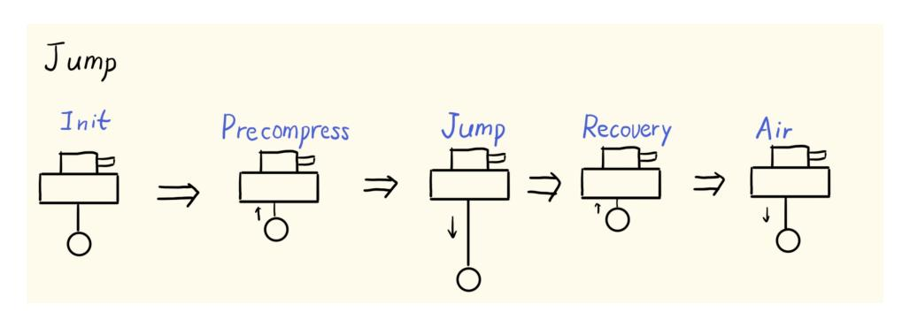

图 10: 跳动作示意图

Init 复位 PID、清零 air height diff,然后按当前速度方向单边限幅锁存位置偏 差:

$$\Delta s = s_{ref} - s, \quad \Delta s \leftarrow \begin{cases} \text{clamp}(\Delta s, 0, +0.8), & \dot{s} > 0, \\ \text{clamp}(\Delta s, -0.8, 0), & \dot{s} < 0. \end{cases} \quad (141)$$

随后把位置参考置为 ∆s、实测位置清零、锁存空中速度指令与高度指令,清零飞 行节拍,直接进入 Air。

#### Air 动作与 Jump/Air 的逻辑相同。

没有触地的悬空腿恒定下推 80 N 快速主动伸腿,确保能够快速触地,触地腿沿用 常规腿长 PID。当悬空腿接近最大腿长后不再施加额外推力。

Flight 期间 LQR 增益掩码

$$m_{flight} = \begin{bmatrix} 0 & 0 & 0 & 0 & 1 & 1 & 1 & 1 & 0 & 0 \end{bmatrix} \quad (142)$$

只保留腿摆角与腿摆角速度通道。空中没有支撑,仅能控制腿的摆动。触地轮由计算得 到的轮力矩驱动,悬空轮力矩置零。两腿的腿摆矩均由 LQR 计算得到。

退出:两条腿都被判为触地,进入 Return。 Return 把高度指令恢复为腾空前记录 的高度指令,把俯仰参考设为当前实际俯仰,腿摆角参考锁存为当前实际值。

# 13.10 第三层:Onestep / Twostep(上台阶)子状态机

其实两者的动作几乎没有本质区别,只是当时设计的时候考虑上台阶后的腿长做 了一个区分,实际操作中可以用只设计一个上台阶的状态机,然后在上台阶后根据指令 要求与计数器来判断腿长指令即可。

Init 锁存两条虚拟腿的角度和长度作为动作起点,并记录位置偏差 ∆s = sref − s。位 置偏差要进行限幅,限幅值为 0.5 m。

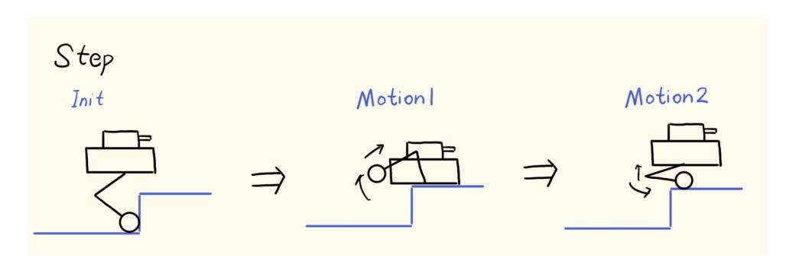

图 11: 上台阶动作示意图

Motion1(后摆收腿) 动作:把机构角参考以 300◦/s 限速摆到上台阶预备角 θ step swing + π/2(θ step swing = 1.45 rad)(注意+π/2 是因为虚拟腿计算与 LQR 对应的 0 起始点不同, 本质都是向后摆),腿长参考以 1.8 m/s 伸到 l mid step = 0.23 m。轮力矩全程为零。

退出:

$$(|l_i - l_{step}^{step}| < 0.05 \text{ m}) \forall i \wedge (|\theta_{i,j} - \theta_{swing}^{step}| < 20^\circ) \forall i. \quad (143)$$

Motion2(收腿) 动作:机构角参考以 270◦/s 转到 π/2 − θb(即竖直向下,类似 DrawBack 动作),腿长以 1.8 m/s 收到 lmin = 0.10 m。

退出:

$$(|l_i - l_{min}| < 0.05 \text{ m}) \forall i \wedge (|l_{t_i}| < 15^\circ) \forall i, \quad (144)$$

Return 做一次完整交接:把 last lqr mode 写为 Onestep/Twostep、清零模式节拍、 把位置参考置为 Init 锁存的 ∆s 并把实测位置与 LQR 内部位置一起清零、锁存航向、 俯仰与两腿腿摆角参考为当前实际值,最后清除记录上台阶次数的标志。

# 13.11 并行维度:工作模式

工作模式描述底盘与云台的相对关系,与控制模式正交:

- Depart(分离):底盘航向独立于云台,操作手直接控制底盘朝向。航向来自 IMU 的绝对航向;
- Follow(跟随):底盘航向跟随云台,参考为 0 或 ±π(允许掉头跟随)。航向来 自 yaw 电机的相对角;
- Gyro(小陀螺):底盘持续旋转,用绝对航向;

绝对/相对两套航向基准的切换是这一维度最容易出错的地方。状态估计层按

rel heading = (wmref = Follow) ∧ (wmcurr ̸= Gyro) (145)

决定 ϕ 取 yaw 电机角还是展开后的 IMU 航向。大家需要注意切换工作模式时要避免因 航向基准切换导致的跳变造成 LQR 误差过大而失控。

# 13.12 指令整形层

操作手/导航给出的原始指令不会直接进入 LQR,而要经过一层整形。即根据加速 度/角加速度使原先阶跃的速度/角速度指令变为斜坡,同时对所以速度/角速度指令进 行限幅,避免 LQR 产生过大的误差。

#### 13.13 防翻保护

高速转向时离心力会使机器人绕外侧轮翻出去,这个约束无法由平面 LQR 模型表 达(模型中没有侧向自由度),必须显式加入。

侧翻临界与乘积上限 先按当前平均腿长 h¯(含轮半径)算出系统等效重心高度

$$H_{cog} = \frac{m_b (h_{cog}^{hip} + \bar{h}) + 2(m_{leg} + m_{wheel}) \frac{\bar{h}}{2}}{m_b + 2(m_{leg} + m_{wheel})}, \quad h_{cog}^{hip} = 0.080 \text{ m}, \quad (146)$$

即简化地认为机体质量集中在髋部质心高度 + 腿长处、腿轮质量集中在腿的中点。

再由内侧轮支持力降到总重的 k 倍即视为侧翻临界反解。稳态转向时内侧轮支持 力为

$$N_{in} = \frac{Mg}{2} - \frac{Mv\omega H_{cog}}{W}, \quad N_{in} = \frac{M}{2}kg \implies (v\omega)_{raw} = \frac{gW(1-k)}{2H_{cog}}, \quad (147)$$

其中 W 为轮距,k = 0.5,即允许内侧轮卸载到静态载荷的一半,k 的具体值可以大家 测试后自行选择。

偏航角加速度预算 纵向质心偏置上的偏航角加速度同样消耗侧翻余量,从裸乘积上限 中扣除:

$$(v\omega)_{lim} = \max(0.75 (v\omega)_{raw} - |\dot{\omega}_z^{cmd} \bar{x}_{cog}|, 0), \quad \bar{x}_{cog} = \frac{x_{cog}^{hip} m_b}{M}, \quad x_{cog}^{hip} = 0.003 \text{ m}, \quad (148)$$

其中 ω˙ cmd z 为偏航角速度指令的差分并限幅在偏航加速度上限内。 0.75 为模型误差余量 (同样自行测试决定余量)。

大摆角额外降额 两腿平均摆角超过 25◦ 后按线性比例继续收紧,最多收到 0.2 倍:

$$(v\omega)_{lim} \leftarrow (v\omega)_{lim} \cdot \text{clamp}\left(1 - \frac{|\bar{\theta}_l| - 25^\circ}{25^\circ}, 0.2, 1\right). \quad (149)$$

实测 LTR 监督 模型算得再准也可能因载荷、地面偏差失真,所以还要用支持力估计 给出的实测载荷转移率兜底:

$$LTR = \frac{F_{N,l} - F_{N,r}}{F_{N,l} + F_{N,r}}, \quad w_{ltr} = 1 - (1 - k_{ltr}^{min}) \text{smoothstep}\left(\text{clamp}\left(\frac{|LTR| - 0.75}{0.92 - 0.75}, 0, 1\right)\right), \quad (150)$$

$$(v\omega)_{lim} \leftarrow w_{ltr}(v\omega)_{lim}, \quad k_{ltr}^{min} = 0.5. \quad (151)$$

两条腿都离地时 LT R 无意义,监督自动跳过。

航向误差钳位 Follow 模式下实际偏航角速度主要由 LQR 的 ϕ 误差项产生,只看指令 的乘积限制管不到这一路。允许的航向误差可由偏航通道自身的增益比反解(持续误差 e 对应的稳态角速度约为 ω ≈ (Kϕ/Kdϕ) e):

$$e_\phi^{max} = \text{clamp}\left(\frac{\omega_{\text{budget}} - \omega_{\text{ffd}}}{K_\phi/K_{\text{d}\phi}}, 15^\circ, 120^\circ\right), \quad \omega_{\text{budget}} = \frac{(v\omega)_{\text{lim}}}{|\dot{s}|}, \quad (152)$$

其中 Kϕ/Kdϕ 每拍由当前增益表的左右轮力矩进行反解(设定最小值 4.05), ωf f d = |ωcmd| + |ϕ˙ f f d| 为已被前馈占用的角速度,速度取实测值。对误差限幅等价于给实际偏 航角速度设了上限,这样才能实现跟随模式下的防翻保护。

超限缩放 若当前 |vxω| 超过上限,按比例 ratio = (vω)lim/|vxω| 缩放:

- 小陀螺模式下只缩放平移速度(vscale = ratio, wscale = 1),不动转速;
- 其他模式下按指数分配:vscale = ratio0.7、 wscale = ratio0.3。把大部分降额压在平 移上,这样手感更自然。

### 13.14 输出链

LQR 的四路输出是两个轮力矩 + 两个虚拟腿力矩,而实际执行器是两个轮电机 + 四个关节电机。中间的映射链如下。

腿长参考的生成 LQR 模型中腿长是参数而非状态,因此腿长必须由独立的 PID 控制 环处理。这条参考链只在 Mature 的 Ctrl 阶段执行,其余模式的腿长参考由各自的执 行分支直接写入。

- 1. 转向降高:当

| $( \omega_z^{\text{inv}}  > 3.0 \text{ rad/s} \vee \dot{s} > 2.0 \text{ m/s}) \wedge \text{wm} \neq \text{Gyro}$ | (153) |
|------------------------------------------------------------------------------------------------------------------|-------|
|------------------------------------------------------------------------------------------------------------------|-------|

时取

$$\Delta h_{turn} = 0.01 \cdot |\dot{\phi} \dot{s}|, \quad (154)$$

并从高度指令中减去,降低重心;

- 2. 异常分支:若当前异常等级为 AbnormalWarn,冻结当前高度参考,改写 LQR 掩 码为 mwarn(见下一小节);
- 3. 高度斜坡:正常分支按 kMaxDH = 0.5 m/s 限斜率跟随 hcmd − ∆hturn,然后限幅;

- 4. 俯仰与空中高度差归零:俯仰角期望按 3.0 rad/s 斜坡回零, air height diff 按 0.5 m/s 斜坡回零并限幅 [0, 0.10] m;
- 5. 滚转环:一个 PID 作用于滚转角的正切值,输出为左右腿长差 ∆hroll = clamp(PIDroll(0 − tan γ), −0.12, +0.12) m, kp = 0.5, ki = 2×10−4 , kd = 2.0,
  - (155)

| $\Delta h_{roll} = \text{clamp}(\text{PID}_{roll}(0 - \tan \gamma), -0.12, +0.12)$ m, | $k_p = 0.5, k_i = 2 \times 10^{-4}, k_d = 2.0,$ |
|---------------------------------------------------------------------------------------|-------------------------------------------------|
|                                                                                       | (155)                                           |

一侧加、一侧减。左右腿长差与滚转角的几何关系为

$$\tan \gamma = \frac{h_l - h_r}{W}, \quad (156)$$

直接对 tan γ 做控制使被控量与控制量成线性关系,增益在大倾角下不容易适配。 这就是机器人过侧向斜坡时保持机体水平的机制;

- 6. 最终腿长参考:

$$l_{ref,i} = \frac{h_f + \Delta h_{air} \pm \Delta h_{roll}}{\cos \theta_{i,i}}, \quad (15.7)$$

除以 cos θl,i 是把竖直高度换算为沿腿方向的长度。左腿取 +∆hroll、右腿取 −∆hroll;

- 7. 限幅:根据不同的模式进行限幅;
- 8. 过坎 overlay:最后对每条正在过坎的腿,把腿长参考直接覆写为 kCrossBankRetractHeight = 0.13 m,绕过上述全部计算(原因见过坎一章)。

防劈叉环 Mature 中都有一个 PID 作用于左右腿摆角之差,输出 ∆τsplit 以相反符号叠 加到两腿的虚拟腿力矩上(τleg,0 −= ∆τsplit,τleg,1 += ∆τsplit),然后再各自加上 LQR 的第 3、4 路输出。

腿长环的双参数组 这个效果其实不是很明显。腿长控制按误差符号选择 PID:

若 
$$l_{ref,i} - l_i > 0 \Rightarrow$$
 用  $\text{PID}_{len[i]}$  (伸腿), 否则用  $\text{PID}_{len[i+2]}$  (收腿). (158)

|    | k p  | k i | k d    | 输出限幅 |     | (N)    |
|----|------|-----|--------|------|-----|--------|
| 伸腿 | 1300 | 0.5 | 150000 | [ −  | 100 | , 400] |
| 收腿 | 1200 | 0.5 | 120000 | [ −  | 100 | , 400] |
| 过坎 | 3000 | 0   | 80000  | [ −  | 200 | , 180] |

一开始我在调 PID 参时发现缩腿一直会抖,所以用了两套 PID。我认为造成腿在缩短 过程中的某一高度发生高频振荡的原因是 PID 参数中的 kd 过大,其本质是重力前馈不 能完全消除重力的影响,伸长时在对抗重力,下降时顺应重力,重力造成的阻尼不同。 所以用单套参数会导致在一个方向上过阻尼、另一个方向上欠阻尼而产生持续振荡。不

过后面觉得都把 kd(注意我使用的 PID 没有考虑控制周期,因此 kd 看起来非常大) 调小一些也是可以用的。

过坎那一套是为了在 0.12 s 的窗口内快速收腿,牺牲平滑度换响应速度。

重力前馈 腿长 PID 的输出上叠加静态重力前馈

$$F_{ffd,i} = \frac{\left(\frac{m_b}{2} + m_{leg} + m_{wheel}\right) g}{\max(\cos \theta_{l,i}, 0.5)}. \quad (159)$$

cos 取下限 0.5,是为了防止腿摆角接近 90◦ 时前馈发散到无穷。

过坎时的推力重算 若该腿正在过坎,代码会用过坎 PID 重新计算一次 leg push force [i]进 行覆盖赋值,因为过坎的腿不承担机体重量所以只减去腿部自重。

$$F_{leg.i} \leftarrow \text{PID}_{len}^{bank}(l_{ret} - l_i) - (m_{leg} + m_{wheel})g. \quad (160)$$

转向载荷转移 在虚拟腿推力上叠加左右反号的一项

$$\Delta F_{rot,i} = \text{clamp}\left(s_i \cdot \left(\frac{m_b}{2} + 0.5 m_{leg}\right) \frac{h_i}{W} \dot{\phi} \dot{s}, -35, +35\right) \text{ N}, \quad s_i = \begin{cases} -1, & i = \text{Left} \\ +1, & i = \text{Right} \end{cases} \quad (161)$$

ϕ˙s >˙ 0(左转前进)时左腿推力减、右腿推力增,对应离心力把机体压向外侧轮的实 际受力分布。公式的物理含义是把离心力矩 MvωH 除以轮距 W 得到左右支持力之差, 再一半分给各侧。

五连杆映射 见前文图片。

弹簧补偿 因为车的弹簧不同,安装位置不同,建议自行建模仿真并进行系统辨识。较 为简单的办法是将弹簧弹力与行程拟合为二次/三次函数关系,然后用简单的力-力臂计 算弹簧对各电机的力矩,最后在电机力矩上叠加补偿。

轮力矩处理 按模式分派:

- Mature/Ctrl:直接取 Twl = LQR 第 1、2 路输出;若某腿正在过坎,该侧轮力 矩额外叠加 ±2.0 N · m,符号按行进方向取(正着开为正),帮助机体越过坎;
- Flight/Air 与 Jump/Air:用 LQR 输出,但逐腿把离地侧的轮力矩置零;
- Jump 的 PreCompress / Jump 阶段:用 LQR 输出(此时仍在地面上);
- Jump/Recovery:轮力矩置零(收腿离地过程中轮子不需要出力);
- Recovery、Onestep、Twostep:轮力矩全部为零。

最终限幅 四个关节力矩最终限幅在 ±40 N · m,这是电机的硬约束。这一步在弹簧补 偿环节的最后执行。

#### 13.15 LQR 增益掩码调度

同一套增益矩阵通过一个十元素的整数掩码 m 适配不同模式,掩码逐元素乘在状 态误差上:

$$\mathbf{U} = -\mathbf{K} [\mathbf{m} \odot \text{clamp}(\mathbf{X} - \mathbf{X}_{ref})] + \mathbf{U}_d, \quad (162)$$

其中 ⊙ 为逐元素乘。这等价于选择性地开关反馈通道。各模式的掩码按状态顺序 [s, s, ϕ, ˙ ϕ, θ ˙ l,l, ˙θl,l, θl,r, ˙θl,r, θb, ˙θb] 排列:

$$\mathbf{m}_{mature} = \begin{bmatrix} 1 & 1 & 1 & 1 & 1 & 1 & 1 & 1 & 1 & 1 \\ & & 1 & 1 & 1 & 1 & 1 & 1 & 1 & 1 \\ & & & 1 & 1 & 1 & 1 & 1 & 1 & 1 \\ & & & & 1 & 1 & 1 & 1 & 1 & 1 \\ & & & & & 1 & 1 & 1 & 1 & 1 \\ & & & & & & 1 & 1 & 1 & 1 \\ & & & & & & & 1 & 1 & 1 \\ & & & & & & & & 1 & 1 \\ & & & & & & & & & 1 \end{bmatrix}, \quad (163)$$

$$\mathbf{m}_{flight} = \begin{bmatrix} 0 & 0 & 0 & 0 & 1 & 1 & 1 & 1 & 0 & 0 \end{bmatrix}, \quad (164)$$

$$\mathbf{m}_{jump} = \begin{bmatrix} 0 & 0 & 1 & 1 & 1 & 1 & 1 & 1 & 1 \end{bmatrix}, \quad (165)$$

| $m_{bank} = \left[ \begin{array}{ccccccc} 0 & 0 & 1 & 1 & 1 & 1 & 1 & 1 \end{array} \right],$ | (166) |
|-----------------------------------------------------------------------------------------------|-------|
|-----------------------------------------------------------------------------------------------|-------|

$$m_{warn} = \begin{bmatrix} 0 & 1 & 0 & 0 & 1 & 1 & 1 & 1 & 1 & 1 \end{bmatrix}, \quad (167)$$

$$\mathbf{m}_{land} = \left[ \begin{array}{ccccccccccc} 0 & 1 & 1 & 1 & 1 & 1 & 1 & 1 & 1 & 1 \end{array} \right]. \quad (168)$$

- Mature:全一,所有通道使能;
- Flight:仅腿摆角与腿摆角速度通道为 1。空中只能控腿摆角;
- Jump:起跳过程中要确保除速度/位置外跟随,避免发生转体;
- 过坎:屏蔽位置与速度。测试下来效果不明显,全一也是可以的;
- 异常警告:屏蔽位置与航向(ϕ, ϕ˙)两组通道,但保留速度通道,确保可以进行脱 困。
- • 落地缓冲期:单独把位置通道置零,只跟速度不跟位置。

# 14 过坎

#### 14.1 有趣设计

比赛场地上下二级台阶和直接下高地有高度 5 cm 的小坎。这想必是云浩的小巧思, 挺有意思的。这类障碍的特点是:太小,前测距测不到,如果选择在机体下面装测距就 要严格限制行进速度,不然就要训练操作手,不稳定;又太大,不能像大弹丸一样硬撞 过去,不过倒着开有概率能开下去;操作手大概率会选择斜着下二级台阶。

所以过坎需要的是一个快、轻、逐腿独立的处理。在被挡住的瞬间把那一条腿主动 收短,让轮子从坎上"翻"过去,另一条腿不受影响,整个过程不打断行进也不改变控 制模式。

## 14.2 检测判据

碰坎与正常路面颠簸、急减速、被撞,尤其是踩弹丸在低维信号上非常相似,必须 用多个信号的组合把它们区分开。系统使用主判据(腿运动学三重与) 与辅判据(车 身俯仰)的逻辑或。

主判据基于这样的观察,轮子被坎挡住时,轮心被卡住,而机体仍以原速前进,于 是虚拟腿被快速向后甩,表现为腿摆角速度、腿摆角加速度、腿末端加速度三者同时出 现异常大的值。经过测试记录,写成判据:

$$K_i = \underbrace{\left( |\dot{\theta}_{l,i}| > 2.2 \text{ rad/s} \right)}_{\text{腿甩动}} \wedge \underbrace{\left( |\dot{\theta}_{l,i}| > 75 \text{ rad/s}^2 \right)}_{\text{甩动突发}} \wedge \underbrace{\left( |\ddot{p}_{e,i}| > 37 \text{ m/s}^2 \right)}_{\text{腿端受到冲击}}. \quad (169)$$

三个门限的实测背景值分别约为:正常行进时 | ˙θl | 低于 π、碰坎时 | ¨θl | 约 200 rad/s 2、 腿端加速度 |p¨e| 约 40 m/s 2。门限都取在实测碰坎值与正常行进值之间偏保守的位置。

辅判据处理正对坎开下去的情形。正面撞上坎时两轮接近同时被挡,机体俯仰会发 生显著变化:

$$B = (|\theta_b| > 8^\circ). \quad (170)$$

合成后,第 i 条腿的原始碰坎信号为

$$r_i = K_i \vee B. \quad (171)$$

# 14.3 触发条件与使能门控

原始信号 ri 还要经过消抖与一系列使能条件才能真正置位过坎标志:

$$c_i \leftarrow 1 \iff \underbrace{T_{r_i} > 10 \text{ ms}}_{\text{消抖}} \wedge \underbrace{\text{cross\_bank\_allowed}}_{\text{功能开关}} \quad (172)$$

$$\wedge \underbrace{(\text{mode} = \text{Mature})}_{\text{仅平衡态}}.$$

为了避免连续误触发,可以加入要求同腿必须经过 800 ms 的冷却后才能再次触发的逻 辑。

# 14.4 触发后的动作

过坎标志置位后,在 Mature 的正常控制流上叠加五项修改,作用于该条腿与整 车。

(1) 收腿 把该腿的腿长参考直接覆写为收腿高度,即将腿长从 0.21m 收到 0.15m,收 6cm 左右,比坎略高一些,辅助越坎。如果QR矩阵调的好的话,只做收腿动作也可以 直接实现过坎。需注意的是收腿需要尽量快,因为坎需要碰撞来检测,意味着收腿时车 已经碰到坎了,收腿慢的话车就会翻倒。

(2) 轮力矩偏置 在触坎的腿的轮LQR输出力矩上叠加一个固定偏置用于辅助蹭上坎 沿。实车测试时设置的固定偏置为 2.0 N · m。

使用固定偏置可能不够合理,但是因为时间和场地原因就没有做更多的考量了。后 来比赛结束后想了想,也许可以用模型一步预测值与实测值的偏差来进行比例补偿,轮 力矩和虚拟腿摆矩都进行补偿,大家可以尝试下。

(3) 腿摆角参考 在越过触坎条件的一帧记录当前腿摆角作为过坎时的初始参考,然后 过坎过程中逐渐回到零。这个动作的本意是想规划过坎的轨迹更加顺滑,构建类似弧线 轨迹,不过实际测试下来作用不大,大家权当参考就行。

(4) 俯仰参考 这一项是整机量,只要任意一条腿在过坎(cl ∨ cr)就整体生效。机体 俯仰参考值经限斜率后叠加到俯仰参考上:

$$\Delta\theta_b^{target} = \begin{cases} d \cdot \text{kCrossBankThetaBBias}, & c_l \vee c_r, & \text{kCrossBankThetaBBias} = 2.0^\circ \approx 0.035 \text{ rad}, \\ 0, & \text{否则}, & \end{cases} \quad (173)$$

$$\Delta\theta_b \leftarrow \text{LimDiff}(\Delta\theta_b^{target}, \Delta\theta_b, \text{kCrossBankThetaBBiasRate} = 120^\circ/\text{s}), \quad \theta_b^{ref} += \Delta\theta_b. \quad (174)$$

偏置本身只有 2 ◦,是一个很小的引导量,而不是一个大幅度的主动倾身动作。但是旋 转方向比较重要,前面提到的 2.0 ◦ 是在正着开的条件下(即过坎时主动向下俯),倒着 开需取负号。

在测试中,有试过不做任何处理,也可以成功过坎,不过成功率下降了;也尝试过 向反方向旋转,基本都失败了。因为车体在过坎时本就会向下俯,不如让参考跟随动作 的姿态轨迹,避免 LQR 的对抗。

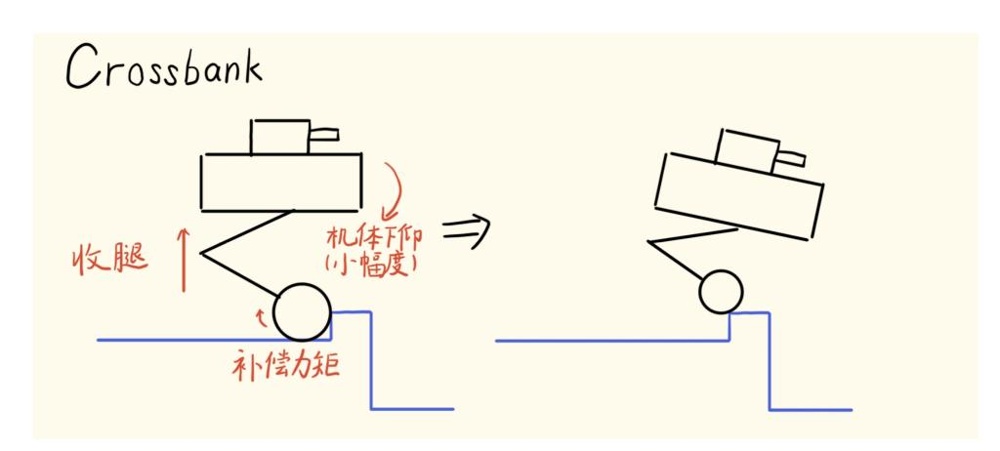

图 12: 过坎动作示意图

## 14.5 退出条件

过坎标志的清除有两条路径,取逻辑或:

$$c_i \leftarrow 0 \iff \underbrace{(l_i < l_{retract} + 0.02 \text{ m})}_{\text{收腿已到位}} \vee \underbrace{(T_{c_i} > 0.12 \text{ s})}_{\text{超时}}. \quad (175)$$

第一条是正常退出:腿已经收到目标高度(目标高度可以适当设置低一些)附近,说明 抬脚动作已完成,轮子应当已经在坎上或即将上坎,可以恢复常规控制。

第二条是超时保护,0.12 s。这个值是在拍摄视频记录过坎大致所需的时间后设置 的。大家需要自行拍摄视频记录后设置合适的时间。

#### 14.6 成功率

根据测试,这一套过坎动作正面过坎是最难的,反面过坎相对容易。如果可以以相 对正对坎有 15◦ 30◦ 的角度斜着过坎,成功率会大幅提升。根据测试,最好是在匀速或 减速时过坎,加速时过坎成功率非常低,几乎不会成功,与腿的摆角相关。

# 15 纵向控制体系

本节内容主要是给步兵做的,哨兵有没有其实不太打紧(丢给导航的 MPC 何乐而 不为呢,嘻嘻),目的也是提升操作手手感。不过也许叠了太多 trick 反而让原本更加 简洁美丽的体系变得更复杂,失去了其原先的优雅,而且也有很多需要优化的地方。因 此大家也可以选择性参考吧。

它取代并扩展了 [13.7](#page-37-0) 小节中参考量生成与位置参考积分两步的旧描述(该小节的 其余步骤仍然有效)。整个体系链为:遥控或导航指令 → 纵向轨迹规划器(生成速度 参考与指令加速度) → 摆腿前馈(第 [8](#page-15-3) 节)与静态配平(生成腿摆角参考) → LQR 求解;与之并行的还有一条虚拟腿大摆角参考降权的安全环。均见下。

# 15.1 纵向速度轨迹规划器

速度参考设计为一个带相位语义的轨迹规划器。它区分两种输入源(遥控器与键 鼠),维护轨迹状态 (P, s˙ref , acmd):相位 P ∈ {Track, BrakeToHold, BrakeToReverse, Hold}、 速度参考 s˙ref 与指令加速度 acmd。

零位判定 遥控器摇杆输入采用带滞回的锁存。毕竟人手几乎不可能能推出几厘米每秒 的速度,不如直接置零。

$$|u_{rc}| \leq 0.025 \Rightarrow \text{锁零}, \quad |u_{rc}| \geq 0.045 \Rightarrow \text{解锁}, \quad (176)$$

其中 urc 为归一化摇杆量;键鼠可以很明确是 0 或 1,所以影响不大。

速度参考与指令加速度 目标速度先限幅 s˙ ∗ = clamp( ˙sreq, ±s˙lim),再判断是否处于减 速状态:

$$\text{reducing} = \underbrace{\text{zero}}_{\text{零指令}} \vee \underbrace{(\neg \text{same\_dir} \wedge |\dot{s}_{ref}| > 0.03)}_{\text{反向指令且还在动}} \vee \underbrace{(\text{same\_dir} \wedge |\dot{s}^*| < |\dot{s}_{ref}|)}_{\text{同向减速}}, \quad (177)$$

减速分支使用减速加速度上限,其余分支使用动态加速度上限(见第 [15.5](#page-53-1) 小节)。速度 参考由限斜率给出:

$$\dot{s}_{ref}(k) = \dot{s}_{ref}(k-1) + \text{clamp}(\dot{s}^* - \dot{s}_{ref}(k-1), -a_{eff}\Delta t, +a_{eff}\Delta t), \quad (178)$$

零指令下以 s˙snap = 0.03 m/s 为门限吸附到零,避免参考在零附近长期游走。指令加速 度不另设微分环节,直接取速度参考的实际变化率:

$$a_{cmd}(k) = \frac{\dot{s}_{ref}(k) - \dot{s}_{ref}(k-1)}{\Delta t}, \quad (179)$$

它是摆腿前馈的输入,只有斜坡期内非零。

相位本身只用于位置策略与调试,不阻塞速度指令,反向指令不再等待实际车速进 入停车窗口,因此不会卡在刹车状态而对后续摇杆或键鼠指令无响应。

## 15.2 摆腿前馈的在线生成

第 [8](#page-15-3) 节解决了前馈参数的离线寻优,这里补上在线侧的链路。前馈的输入是上一 步的 acmd,输出是腿摆角前馈 (θf f d, ˙θf f d),共四个步骤。

几何上限 腿摆角决定了轮子能把支撑点移动到离质心多远的位置,但摆角受机构几何 约束:设当前高度指令为 h,几何最大摆角为

$$\theta_{geom}(h) = \arccos\left(\text{clamp}\left(\frac{h}{0.33}, 0, 1\right)\right), \quad \theta_{max}^{leg} = \max(\min(18^\circ, 0.55\theta_{geom}(h)), 0), \quad (180)$$

留 0.55 的机构余量并用 18◦ 封顶。腿越长(h 越大),机体越不稳定,同时腿很长时 LQR 的输出可能超出了可行域,所以需要让允许的前馈摆角变小。

需求门控 前馈只在追速度时才应该出力。定义需求 d = |s˙cmd −s˙|,用滞回避免门限抖 动: d > 0.20 m/s 开启、d < 0.15 m/s 关闭,开启后缩放系数为

$$\sigma_{demand} = \text{clamp}\left(\frac{d - 0.15}{0.35 \dot{s}_{max} - 0.15}, 0, 1\right), \quad \theta_{max} = \theta_{max}^{leg} \cdot \sigma_{demand}, \quad (181)$$

需求接近 1 m/s 时前馈全额输出。门控关闭时前馈以 3.0 rad/s 限速衰减回零。

不过上面的门限参数可能不合理,因为测试下来发现加减速的超调比较严重,具体 门限需要自行测试后得到。

增益与前馈量 摆角-加速度增益按腿长分两段合成,解析部分来自倒立摆的准静态关 系,标定部分是一张四点查表(离线寻优得到,见第 [8](#page-15-3) 节):

$$k_l(h) = \frac{H_{cog}(l)}{g} \frac{M}{m_{swing}} \cdot \text{LUT}(h), \quad \text{LUT}(h) = \begin{cases} 0.5704, & h = 0.12 \\ 0.4612, & h = 0.18 \\ 0.3688, & h = 0.24 \\ 0.2507, & h = 0.32 \end{cases} \quad (182)$$

(中间高度线性插值),其中 mswing = mb + mleg + mwheel 为摆动侧等效质量。目标前 馈角与实际输出为

$$\theta^* = k_l(h) a_{cmd}, \quad \theta_{ffd}(k) = \theta_{ffd}(k-1) + \frac{\Delta t}{\tau(h)} [\text{clamp}(\theta^*, \pm\theta_{max}) - \theta_{ffd}(k-1)], \quad (183)$$

一阶滤波的时间常数也随腿长调度, τ (h) 从短腿的 0.058 s 增大到长腿的 0.200 s。角速 度前馈取解析微分:

$$\dot{\theta}_{ffd} = \frac{\theta^* - \theta_{ffd}}{\tau(h)}. \quad (184)$$

不用差分是因为当前QR参数下的 LQR 增益里腿摆角速度通道的阻尼项较大(约 5.2), 差分噪声经过它会变成力矩纹波,而解析微分在 θ ∗ 阶跃时给出平滑的指数衰减速率, 与滤波器自身动力学一致。

#### 15.3 静态配平与摆角参考合成

大家可能会遇到零指令下机体因重心偏移持续后滑的问题,一方面可以调整仿真 参数中的机体质心到左右腿连线中心的水平距离偏移然后调整位移的权重,另一方面 也可以在固件里做一个静态配平环。

我用了一个极慢的积分器把这种静态不平衡配平到腿摆角上:

| $\theta_{trim}(k) = \text{clamp}(\theta_{trim}(k-1) + k_{i,trim}(s_{ref} - s) \Delta t, -\theta_{trim}^{max}, +\theta_{trim}^{max}),$ 
 <math>k_{i,trim} = 0.07, \theta_{trim}^{max} = 5^\circ,</math>  (185) 
 |
|--------------------------------------------------------------------------------------------------------------------------------------------------------------------------------------------------------------------------------------------------------------------------------------------|
|--------------------------------------------------------------------------------------------------------------------------------------------------------------------------------------------------------------------------------------------------------------------------------------------|

一般来说只有原地站住却还在缓慢滑动这一种工况需要积累配平,时间常数约 10 s,与 平衡环完全解耦。用腿摆角配平而不用机体俯仰(原因好像挺明显的),有两个原因: 其一,单位腿摆角移动的质心距离约为 dCOG/dθl = (mswing/M)l ≈ 0.122 m/rad,而 单位俯仰只有 dCOG/dθb = lc mb/M ≈ 0.065 m/rad,腿摆角效率高约 1.9 倍;其二,腿 摆配平不影响机体姿态,云台的瞄准基准不会被破坏。

前馈与配平合成后写入两腿共同的摆角参考,总钳位给配平留出余量:

$$\theta_l^{ref} = \theta_r^{ref} = \text{clamp}(\theta_{ffd} + \theta_{trim}, -(\theta_{max} + \theta_{trim}^{max}), \theta_{max} + \theta_{trim}^{max}), \quad \dot{\theta}_l^{ref} = \dot{\theta}_r^{ref} = \dot{\theta}_{ffd}. \quad (186)$$

#### 15.4 大摆角参考降权

腿摆角已经很大时,说明 LQR 正在用大幅摆腿维持平衡,此时继续追位置与航向 会让两套东西互相打架。因此可以按最大腿摆角计算一个追踪缩放系数:

$$\sigma_{swing} = 1\text{-smoothstep}\left(\text{clamp}\left(\frac{\max_i |\theta_{l,i}| - \theta_{start}}{\theta_{stop} - \theta_{start}}, 0, 1\right)\right), \quad \theta_{start} = 30^\circ, \quad \theta_{stop} = 45^\circ, \quad (187)$$

其中 smoothstep(x) = x 2 (3 − 2x)。缩放以 10 s−1 的速率下降、1.5 s−1 恢复(撤除比介 入慢,避免振荡)。它与前馈摆角是配套的,前馈负责规划出来的摆角有界,而 LQR 为跟踪速度参考自行摆出的部分由本环节与加速度限制共同兜底。

#### 15.5 加速度与速度上限的高度调度

加减速度上限随指令高度线性下降,腿越长上限越低:

---

$$a_{max}(h) = a_{low} - \frac{h - h_{low}}{h_{max} - h_{low}} (a_{low} - a_{high}), \quad h_{low} = 0.20 \text{ m}, \quad a_{high} = 2.0 \text{ m/s}^2, \quad (188)$$

---

加速侧 alow = 2.2 m/s 2,减速侧 alow = 2.5 m/s 2, h cmd max = 0.33 m。在此基础上加速侧还 有一层随车速的动态衰减,起步时给满加速度,接近限速时余弦衰减到 0.8 倍,使到速 过程更柔和:

$$a_{dyn} = a_{max}(h) \left[ 0.8 + 0.2 \cos\left(\frac{\pi}{2} \frac{|\dot{s}|}{\dot{s}_{lim}}\right) \right]. \quad (189)$$

减速侧不做动态衰减。这些上限只作用于轨迹规划器的 aef f,前馈摆角的钳位与之解 耦,加速度该多大就多大,前馈贡献的摆角由自己的硬钳位保证有界。

速度上限同样随高度下降:设

$$\text{ratio} = \text{clamp}\left(\frac{\bar{h} - (h_{mid} + R_w)}{h_{max} + R_w - (h_{mid} + R_w)}, 0, 1\right), \quad \dot{s}_{lim} = \dot{s}_{base}(1 - 0.5 \text{ ratio}), \quad (190)$$

#### 15.6 跟随模式下的航向收敛

跟随模式下偏航角速度指令同样经过限斜率,而航向角参考以一个固定速率向目 标角(0、±π 或 ±π/2)收敛:

$$\dot{\phi}_{conv} = \text{clamp}\left(\frac{0.75 (v\omega)_{raw}}{\max(|\dot{s}|, 0.05)}, 0, \dot{\phi}_{max}\right), \quad (191)$$

收敛速率直接由防翻保护的裸乘积上限反解(见第 [13.13](#page-43-1) 节),速度越快、腿越长,允 许的航向收敛越慢。

# 附件 轮腿机器人底盘功率模型

模型形式:

$$P(t) = c_0 + c_1 va + c_2 \omega \alpha + c_3 a^2 + c_4 \alpha^2 + c_5 |v| + c_6 |\omega| + c_7 v^2 + c_8 \omega^2 + c_9 |a| + c_{10} |\alpha| + c_{11} |v\omega|, \quad (192)$$

其中:

- v:底盘速度测量值 [m/s];
- ω:底盘角速度测量值 [rad/s];
- a = dv/dt [m/s 2 ];
- α = dω/dt [rad/s 2 ];
- P:底盘电功率 [W]。

## 辨识系数

表 2: 辨识得到的系数

| 编号    | 项    | 系数值       |
|-------|------|-----------|
| c0 | 1（偏置） | 0.218199  |
| c1   | va   | 37.554289 |
| c2   | ωα   | 0.900376  |
| c3   | a²   | 3.747340  |
| c4   | α²   | 0.053352  |
| c5   | \|v\|    | 13.085010 |
| c6   | \|ω\|    | 3.755907  |
| c7   | v²   | 7.724018  |
| c8   | ω²   | 0.287786  |
| c9   | \|a\|    | 10.022177 |
| c10  | \|α\|    | 0.000000  |
| c11  | \|vω\|   | 4.723325  |

# 全局拟合指标

表 3: 全局拟合指标

| 指标     | 数值   |
|--------|------|
| RMSE   | 14.0930 |
| MAE    | 9.3454 |
| R²     | 0.9150 |
| 最大绝对误差 | 81.7237 |
| 平均功率   | 50.8316 |
| 功率标准差  | 48.3393 |